Semi-synthetic data example: Impact of noise
================
Compiled at 2024-04-27 11:23:52 UTC

#### Document overview

In this document we generate a synthetic outcome $y$ based on a
combination of linear and interaction effects from real 16s data from
the American Gut cohort on phylum level.

First we do this for multiple SNR, then we fix the noise level and vary
the position of the true (nonzero) interaction effects from highly
variable to less variable interaction features.

#### Required packages and functions

``` r
library("conflicted")
library(trac)
library(ggplot2)
library(gridExtra)
library(RColorBrewer)
```

## 1. Synthetic data generation based on American gut data (OTU level)

``` r
## load data
## This dataset was processed and aggregated in 
## https://github.com/jacobbien/trac-reproducible.
path.data <- "data/"

source("R/sparse_log_contrast.R")
source("R/slc_int.R")
source("R/slc_int_plots.R")
source("R/log-ratio-lasso_interactions.R")
source("R/utils.R")
```

``` r
dat_list <- readRDS(paste0(path.data, "AGP_aggregated.RDS"))
```

``` r
## extract Phylum level
i = "Phylum"
dat_phylum <- dat_list[[i]]
X_phylum <- dat_phylum$x 
y_BMI <- dat_phylum$y
dim(X_phylum)
```

    ## [1] 6266   10

``` r
## calculate amount of nonzero entries per phylum
colSums(X_phylum != 0)/nrow(X_phylum)
```

    ##      Life::k__Bacteria::p__Firmicutes  Life::k__Bacteria::p__Proteobacteria 
    ##                             1.0000000                             1.0000000 
    ##   Life::k__Bacteria::p__Bacteroidetes     Life::k__Bacteria::p__Tenericutes 
    ##                             0.9998404                             0.5472391 
    ##  Life::k__Bacteria::p__Actinobacteria   Life::k__Bacteria::p__Lentisphaerae 
    ##                             0.9980849                             0.2325247 
    ##    Life::k__Bacteria::p__Fusobacteria   Life::k__Bacteria::p__Cyanobacteria 
    ##                             0.2406639                             0.4853176 
    ## Life::k__Bacteria::p__Verrucomicrobia    Life::k__Archaea::p__Euryarchaeota 
    ##                             0.8338653                             0.2531120

``` r
## add pseudo count and build relative abundances
pseudo_count <- 1
X_phylum_psd <- as.matrix(X_phylum + pseudo_count)
X_phylum_rel <- X_phylum_psd/rowSums(X_phylum_psd)
```

``` r
rename_X <- stringr::str_split(colnames(X_phylum_rel), "::")
rename_X <- sapply(rename_X,tail,1)
colnames(X_phylum_rel) <- rename_X
```

### Order phyla by their number of nonzero coefficients

``` r
X_phylum_pa <- (X_phylum > 0)
index_order <- order(colSums(X_phylum_pa), decreasing = T)

X_phylum_rel <- X_phylum_rel[, index_order]
colnames(X_phylum_rel) <- paste(1:ncol(X_phylum))


sparsitiy_features <- 1 - colSums(X_phylum_pa[, index_order])/nrow(X_phylum_pa[, index_order])
names(sparsitiy_features) <- colnames(X_phylum_rel)
round(sparsitiy_features, 2)
```

    ##    1    2    3    4    5    6    7    8    9   10 
    ## 0.00 0.00 0.00 0.00 0.17 0.45 0.51 0.75 0.76 0.77

``` r
## change names from phyla to f1:f10 
## -> avoid numbers only; this causes automatic renaming within the function that we want to avoid
colnames(X_phylum_rel) <- paste0("f", colnames(X_phylum_rel))
```

``` r
## compute interactions 
X_phylum_interact <- compute.interactions.aitchison(X_phylum_rel)
```

``` r
X_phylum_interact_pa <- (X_phylum_interact > 0)
#index_order <- order(sd_lr_X, decreasing = T)
index_order_int <- names(order(colSums(X_phylum_interact_pa), decreasing = T))
```

#### Distribution of input data

main effects

``` r
library(ggplot2)

ggplot() +
  geom_histogram(aes(x = as.vector(X_phylum)), 
                 fill = "lightblue", 
                 color = "black", 
                 bins = 100) +
  theme_minimal() +
  xlab("X (Phylum)")
```

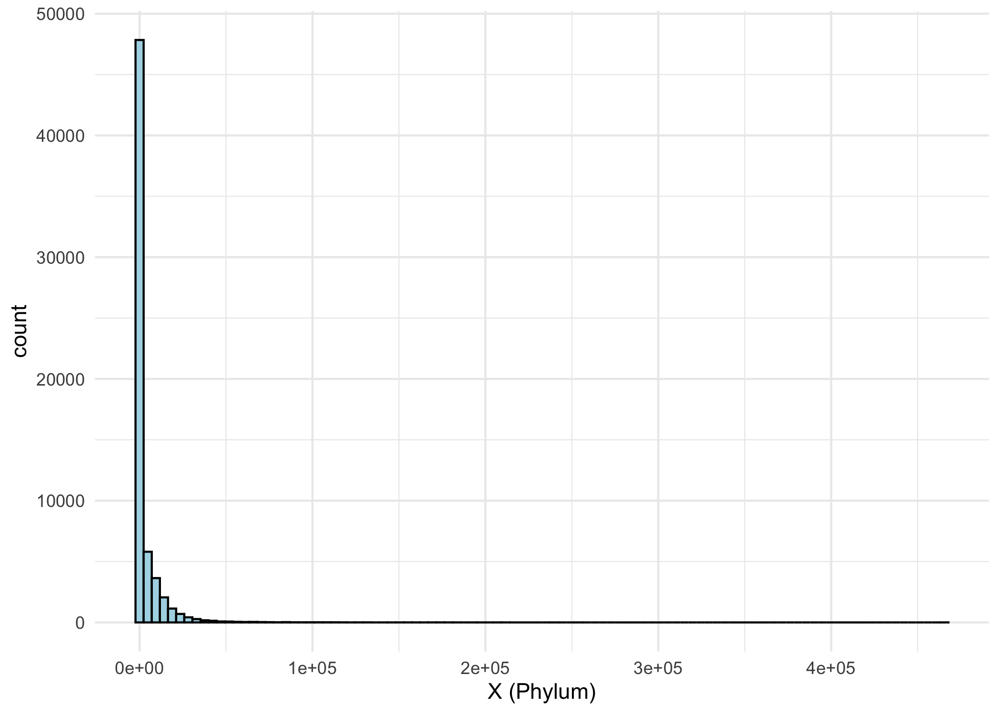<!-- -->

interaction effects/ log ratios

``` r
ggplot() +
  geom_histogram(aes(x = as.vector(X_phylum_interact)), 
                 fill = "lightblue", 
                 color = "black", 
                 bins = 100) +
  theme_minimal() +
  xlab("X interactions (Phylum)")
```

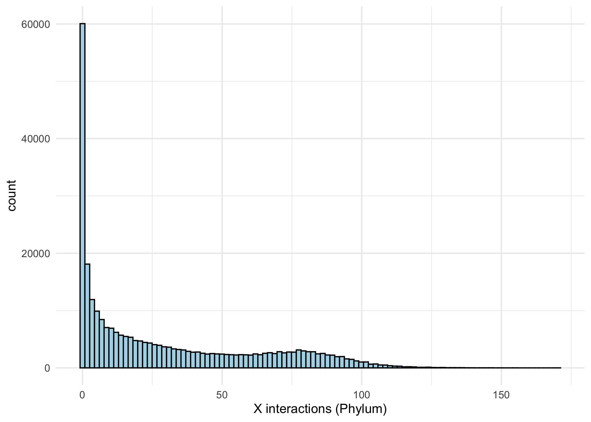<!-- -->

#### Syntetic data generation

``` r
Y_sim_phylum_only_main <- list()

## 6 nonzero main effects
beta_main <-  c(c(10, 20, 30), -c(10, 20, 30))
main_part = log(X_phylum_rel[, c(1:6)]) %*% beta_main

Y_sim_phylum_int <- list()

## 3 nonzero interaction effects
beta_interact = c(10, 10, -10)
interaction_part = X_phylum_interact[, c("f9:f10", "f1:f3", "f8:f10")] %*% beta_interact

## sparsity of the interaction features
sum(X_phylum_interact[, c("f9:f10", "f1:f3", "f8:f10")] == 0)/length(X_phylum_interact[, c("f9:f10", "f1:f3", "f8:f10")])
```

    ## [1] 0.4084477

``` r
## mean sparsity of the corresponding linear features that contribute to interactions
mean(sparsitiy_features[c(1, 3, 9, 10, 8)])
```

    ## [1] 0.4547718

``` r
## 5 different noise factors
NF <-  c(10, 100, 200, 500)
## random noise term
set.seed(123)
noise <- rnorm(nrow(X_phylum_rel))

ii <- 0
for(noisefactor in NF){
  
  ii <- ii + 1
  ## outcome consisting of main effects only
  Y_sim_phylum_only_main[[ii]] <- 10 + main_part + noisefactor * noise
  Y_sim_phylum_only_main[[ii]] <- as.numeric(Y_sim_phylum_only_main[[ii]])
  
  ## outcome consisting of main and interaction effects
  Y_sim_phylum_int[[ii]] <- 10 + main_part + interaction_part + noisefactor * noise
  Y_sim_phylum_int[[ii]] <- as.numeric(Y_sim_phylum_int[[ii]])
  
}
```

### Signal-to-noise ratio

``` r
snr <- c()
### SNR
ii <- 0
for(noisefactor in NF){
  ii <- ii + 1
  snr[ii] <- var(as.vector(main_part + interaction_part))/var(noise * noisefactor)
}
round(snr, 2)
```

    ## [1] 178.01   1.78   0.45   0.07

## Distribution synthetic outcome (Noise factor 1)

``` r
ii <- 1

ggplot(data = data.frame(Y_sim_phylum_int = Y_sim_phylum_int[[ii]])) +
  geom_histogram(aes(x = Y_sim_phylum_int), 
                 fill = "white", 
                 color = "black", 
                 bins = 30) +
  theme_minimal() +
  labs(x = "Generated Y",
       title = "Distribution of Synthetic Y (noise factor 1)")
```

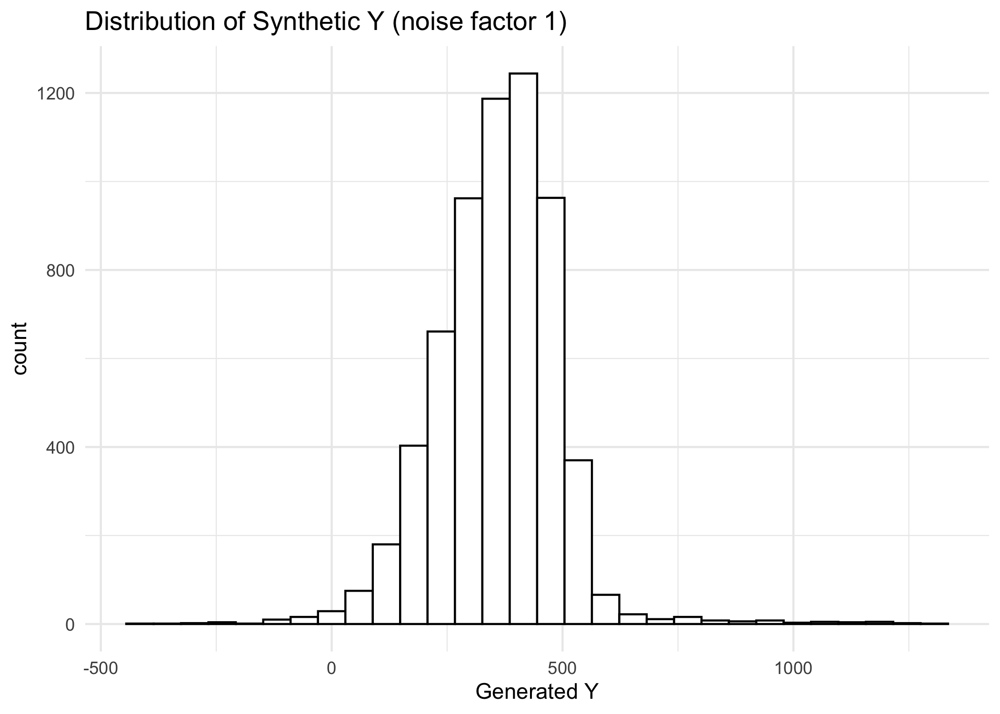<!-- -->

## SLC versus with lcAPLeractions

Now we compare the different approaches based on our synthetic data for
two scenarios:

Scenario 1: generative model with main effects only

Scenario 2: generative model with main + interaction effects

``` r
slc_slc_int_noiselevel_only_main <- list()
slc_slc_int_noiselevel_int <- list()

ii <- 0
for(noisefactor in NF) {
  ii <- ii + 1
  print(paste("NF:", NF[ii]))
  
  slc_slc_int_noiselevel_only_main[[ii]] <- slc_slc_int_all_splits(X = as.matrix(X_phylum_rel),
                                                                   y = Y_sim_phylum_only_main[[ii]],
                                                                   method = "regr", output = "raw")
  
  slc_slc_int_noiselevel_int[[ii]] <- slc_slc_int_all_splits(X = as.matrix(X_phylum_rel),
                                                             y = Y_sim_phylum_int[[ii]],
                                                             method = "regr", output = "raw")
}
```

### OOS MSE: generative model with main effects only

Noise level 1, first split

``` r
ii = 1
r = 1

# Extracting data
data_int <- slc_slc_int_noiselevel_only_main[[ii]]$nnz_int[[r]]
testerr_int <- slc_slc_int_noiselevel_only_main[[ii]]$testerr_int[[r]]

data <- slc_slc_int_noiselevel_only_main[[ii]]$nnz[[r]]
testerr <- slc_slc_int_noiselevel_only_main[[ii]]$testerr[[r]]

# Creating data frames
df_int <- data.frame(nnz_int = data_int, testerr_int = testerr_int)
df <- data.frame(nnz = data, testerr = testerr)

# Creating ggplot
ggplot() +
  geom_line(data = df_int, aes(x = nnz_int, y = testerr_int), color = "blue") +
  geom_line(data = df, aes(x = nnz, y = testerr), color = "red") +
  labs(x = "Number of nonzero features", y = "OOS RMSE", title = paste("Noise level", ii)) +
  theme_minimal() +
  theme(legend.position = "topright") +
  scale_color_manual(values = c("red", "blue")) +
  guides(color = guide_legend(title = NULL))  # Removing the legend title
```

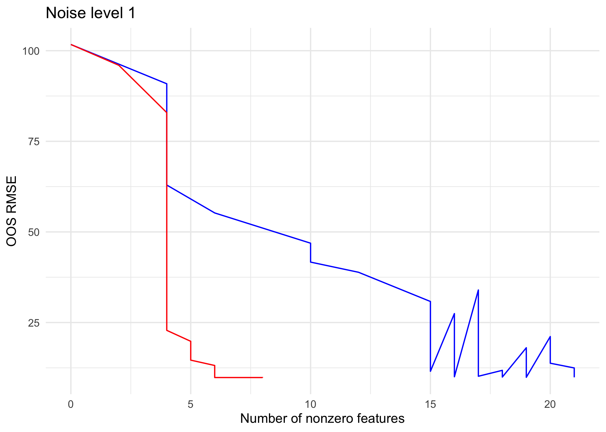<!-- -->

We don’t get any better with an interaction model compared to a model
with main effects only, which is expected if there are no true
interaction effects.

### OOS MSE: generative model with main effects and interaction effects

``` r
ii <- 1
r <- 1

# Extracting data
data_int <- slc_slc_int_noiselevel_int[[ii]]$nnz_int[[r]]
testerr_int <- slc_slc_int_noiselevel_int[[ii]]$testerr_int[[r]]

data <- slc_slc_int_noiselevel_int[[ii]]$nnz[[r]]
testerr <- slc_slc_int_noiselevel_int[[ii]]$testerr[[r]]

# Extracting indices
ind_lam_b <- slc_slc_int_noiselevel_int[[ii]]$cvfit[[r]]$cv$ibest
ind_lam_b2 <- slc_slc_int_noiselevel_int[[ii]]$cvfit_int[[r]]$cv$ibest
ind_lam_1se <- slc_slc_int_noiselevel_int[[ii]]$cvfit[[r]]$cv$i1se
ind_lam_1se2 <- slc_slc_int_noiselevel_int[[ii]]$cvfit_int[[r]]$cv$i1se

# Creating data frames
df_int <- data.frame(nnz_int = data_int, testerr_int = testerr_int)
df <- data.frame(nnz = data, testerr = testerr)

# Creating ggplot
ggplot() +
  geom_line(data = df_int, aes(x = nnz_int, y = testerr_int), color = "blue") +
  geom_line(data = df, aes(x = nnz, y = testerr), color = "red") +
  geom_vline(xintercept = data[ind_lam_b], linetype = "solid", color = "red") +
  geom_vline(xintercept = data[ind_lam_1se], linetype = "dashed", color = "red") +
  geom_vline(xintercept = data_int[ind_lam_b2], linetype = "solid", color = "blue") +
  geom_vline(xintercept = data_int[ind_lam_1se2], linetype = "dashed", color = "blue") +
  labs(x = "Number of nonzero features", y = "OOS RMSE", title = paste("Noise level", ii)) +
  theme_minimal() +
  theme(legend.position = "topright") +
  scale_color_manual(values = c("red", "blue")) +
  guides(color = guide_legend(title = NULL))  # Removing the legend title
```

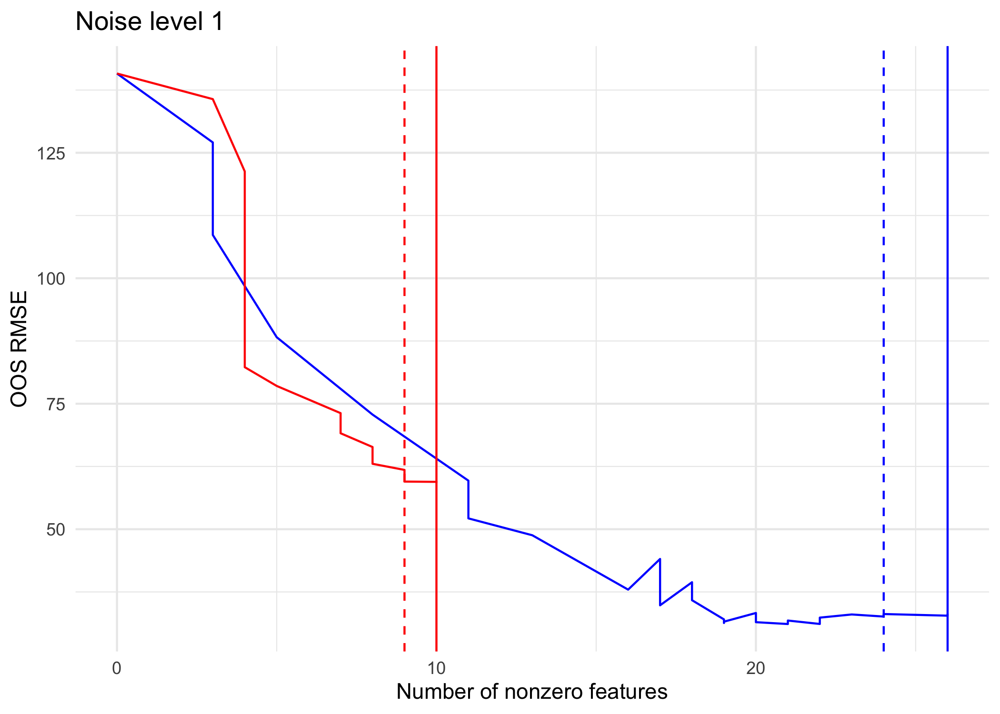<!-- -->

### How good are the models in terms of squared distances for the different noise levels?

``` r
## True coefficients
p = 10
beta_main_all <- rep(0, p)
beta_main_all[c(1:6)] <- beta_main

beta_main_int_all <- rep(0, p * (p + 1)/2)

names(beta_main_int_all) <- c(as.character(1:p), colnames(X_phylum_interact))
beta_main_int_all[c(as.character(c(1:6)), c("f9:f10", "f1:f3", "f8:f10")
) ] <- c(beta_main, beta_interact)
```

### True effects are only main effects

``` r
## Calculate squared distances
nsplit = 10
dist_nf <- matrix(nrow = nsplit, ncol = length(NF))

## rename to have shorter label
mod <- slc_slc_int_noiselevel_only_main

for(ii in seq(length(NF))){
  
  ## extract beta estimates (1se) for each train-test split
  beta_est = mod[[ii]]$beta_est_refit
  dist_nf[, ii] = colSums(sqrt((beta_est - beta_main_all)^2))
}


dist_nf_int <- matrix(nrow = nsplit, ncol = length(NF))

for(ii in seq(length(NF))){
  
  ## extract beta estimates (1se) for each train-test split
  beta_est_int = mod[[ii]]$beta_int_est_refit
  dist_nf_int[, ii] = colSums(sqrt((beta_est_int - beta_main_int_all)^2))
}
```

``` r
colnames(dist_nf) <- paste0("SNR: ", as.character(round(snr,2)))
dist_nf_long <- reshape2::melt(dist_nf)

colnames(dist_nf_int) <- paste0("SNR: ", as.character(round(snr,2)))
dist_nf_int_long <- reshape2::melt(dist_nf_int)


# Create boxplot for dist_nf_long
plt_slc <- ggplot(dist_nf_long, aes(x = Var2, y = value)) +
  geom_boxplot(fill = "white") +
  labs(title = "Main effects model (lcL)",
       x = "Signal-to-noise ratio (SNR)",
       y = "Estimation error") +
  theme(axis.text.x = element_text(angle = 45, hjust = 1)) +
  geom_hline(yintercept = sum(sqrt(beta_main_all^2)), linetype = "dashed") +
  theme_minimal()

# Create boxplot for dist_nf_int_long
plt_slc_int <- ggplot(dist_nf_int_long, aes(x = Var2, y = value)) +
  geom_boxplot(fill = "white") +
  labs(title = "Interaction model (lcAPL)",
       x = "Signal-to-noise ratio (SNR)",
       y = "Estimation error") +
  theme(axis.text.x = element_text(angle = 45, hjust = 1)) +
  geom_hline(yintercept = sum(sqrt((beta_main_int_all)^2)), linetype = "dashed") +
  theme_minimal()

plt_estim_err1 <- grid.arrange(plt_slc, plt_slc_int, ncol = 2)
```

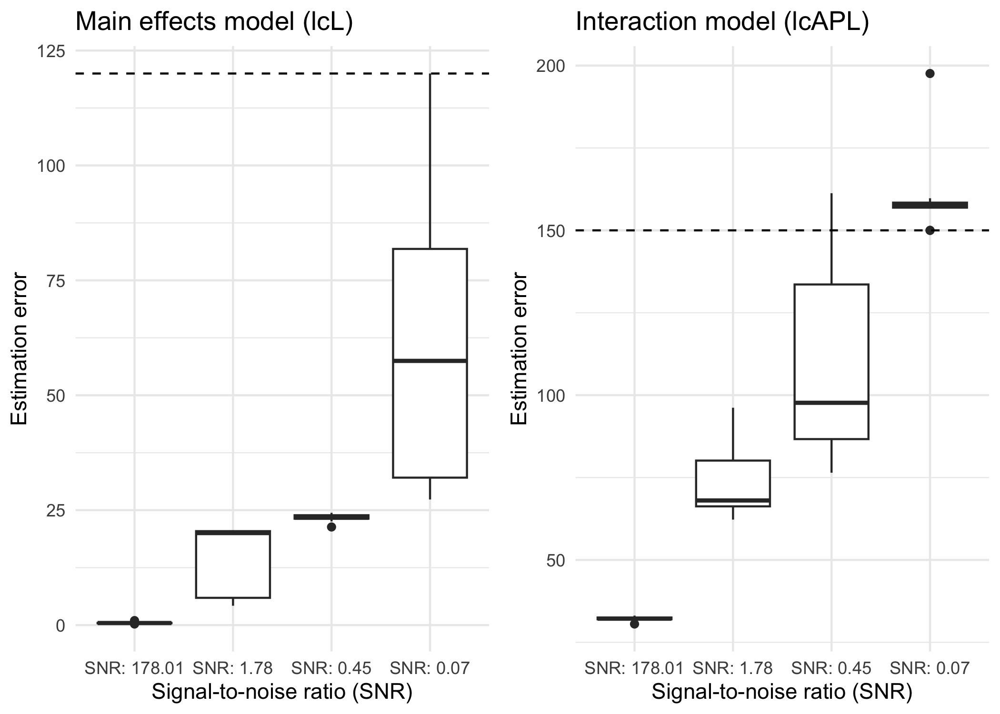<!-- -->

``` r
plt_estim_err1
```

    ## TableGrob (1 x 2) "arrange": 2 grobs
    ##   z     cells    name           grob
    ## 1 1 (1-1,1-1) arrange gtable[layout]
    ## 2 2 (1-1,2-2) arrange gtable[layout]

### True effects are a mixture of main and interaction effects

``` r
## Calculate squared distances
nsplit = 10
dist_nf <- matrix(nrow = nsplit, ncol = length(NF))

## rename to have shorter label
mod <- slc_slc_int_noiselevel_int

for(ii in seq(length(NF))){
  
  ## extract beta estimates (1se) for each train-test split
  beta_est = mod[[ii]]$beta_est_refit
  dist_nf[, ii] = colSums(sqrt((beta_est - beta_main_all)^2))
}

dist_nf_int <- matrix(nrow = nsplit, ncol = length(NF))

for(ii in seq(length(NF))){
  
  ## extract beta estimates (1se) for each train-test split
  beta_est_int = mod[[ii]]$beta_int_est_refit
  dist_nf_int[, ii] = colSums(sqrt((beta_est_int - beta_main_int_all)^2))
}
```

``` r
colnames(dist_nf) <- paste0("SNR: ", as.character(round(snr,2)))
dist_nf_long <- reshape2::melt(dist_nf)

colnames(dist_nf_int) <- paste0("SNR: ", as.character(round(snr,2)))
dist_nf_int_long <- reshape2::melt(dist_nf_int)


# Create boxplot for dist_nf_long
plt_slc <- ggplot(dist_nf_long, aes(x = Var2, y = value)) +
  geom_boxplot(fill = "white") +
  labs(title = "Main effects model (lcL)",
       x = "Signal-to-noise ratio (SNR)",
       y = "Estimation error") +
  theme(axis.text.x = element_text(angle = 45, hjust = 1)) +
  geom_hline(yintercept = sum(sqrt(beta_main_all^2)), linetype = "dashed") +
  theme_minimal()

# Create boxplot for dist_nf_int_long
plt_slc_int <- ggplot(dist_nf_int_long, aes(x = Var2, y = value)) +
  geom_boxplot(fill = "white") + labs(title = "Interaction model (lcAPL)",
       x = "Signal-to-noise ratio (SNR)",
       y = 
       expression("Estimation error"~~sqrt((gamma^'*' - hat(gamma))^2))

) +
  theme(axis.text.x = element_text(angle = 45, hjust = 1)) +
  geom_hline(yintercept = sum(sqrt((beta_main_int_all)^2)), linetype = "dashed") +
  theme_minimal()

(plt_estim_err1 <- grid.arrange(plt_slc, plt_slc_int, ncol = 2))
```

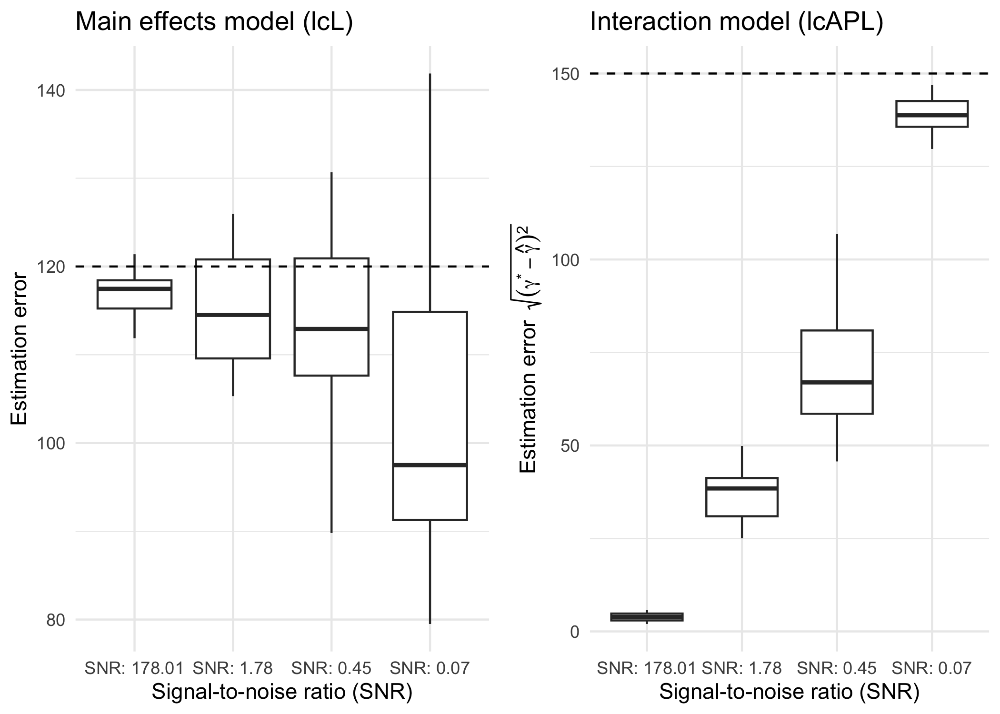<!-- -->

    ## TableGrob (1 x 2) "arrange": 2 grobs
    ##   z     cells    name           grob
    ## 1 1 (1-1,1-1) arrange gtable[layout]
    ## 2 2 (1-1,2-2) arrange gtable[layout]

``` r
round(apply(dist_nf_int, 2, median), 2)
```

    ## SNR: 178.01   SNR: 1.78   SNR: 0.45   SNR: 0.07 
    ##        3.89       38.44       66.96      138.78

``` r
round(apply(dist_nf_int, 2, var), 2)
```

    ## SNR: 178.01   SNR: 1.78   SNR: 0.45   SNR: 0.07 
    ##        1.74       57.44      362.86       30.35

In a scenario with true main and interaction effects the squared
distance between the true main effects and the estimated betas in the
SLC model is very large.

### How good is the slc model at detecting the correct features?

``` r
p = 10
ii = 1
library(ggplot2)
library(reshape2)

# Reshape the data to long format using melt
data_long <- melt(mod[[ii]]$beta_est_refit)

# Create a boxplot using ggplot2
plt_coef_main <- ggplot(data_long, aes(x = as.factor(Var1), y = value)) +
  geom_boxplot(fill = "white", color = "black") +
  geom_segment(data = data.frame(x = 1:p, y = beta_main_all), 
               aes(x=x, xend=x, y=0, yend=y), color="darkorange3") +
 geom_point(data = data.frame(x = 1:p, y = beta_main_all), aes(x, y, color = "True main effect"), pch = 20, size = 3, alpha = 1) +
  labs(
    y = "Estimated coefficients 10 splits",
    title = paste0("Main effects model (lcL), SNR ", round(snr,2)[ii]),
  ) +
  theme_minimal() +
  scale_x_discrete(name = "Main effect features") +
  scale_color_manual(values = c("True main effect" = "darkorange3"), name = "Legend") +
  guides(fill = guide_legend(title = "Boxplot")) + theme(legend.position="bottom")


plt_exp <- plt_coef_main +  theme(axis.text.x = element_text( color="black", size=10),
          axis.text.y = element_text(color="black", 
                           size=10))
```

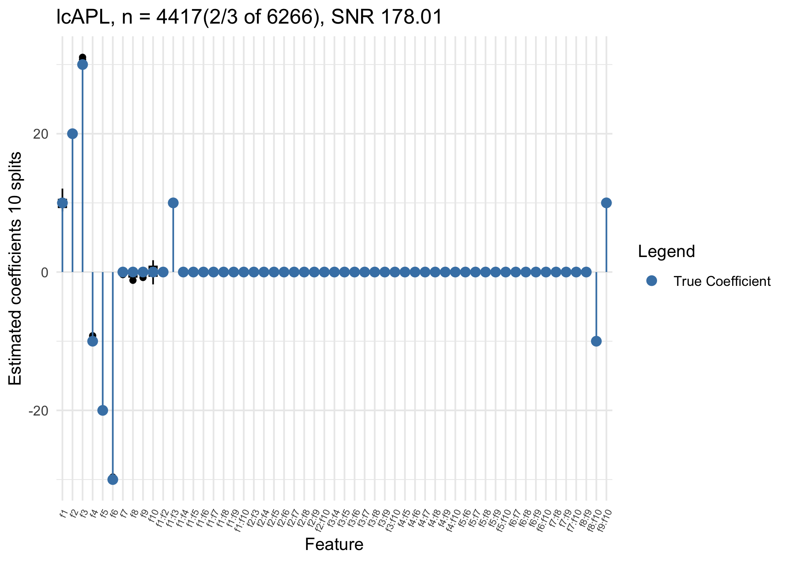<!-- -->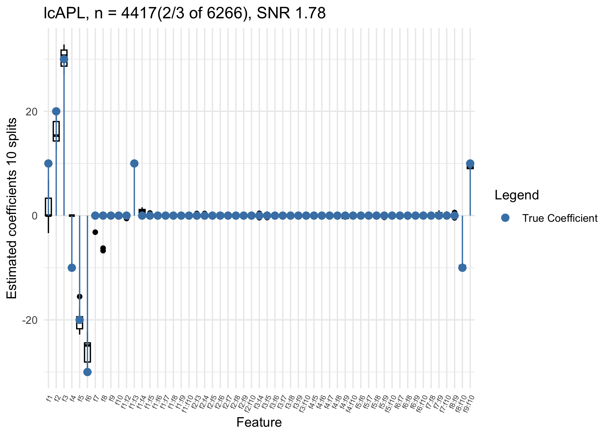<!-- -->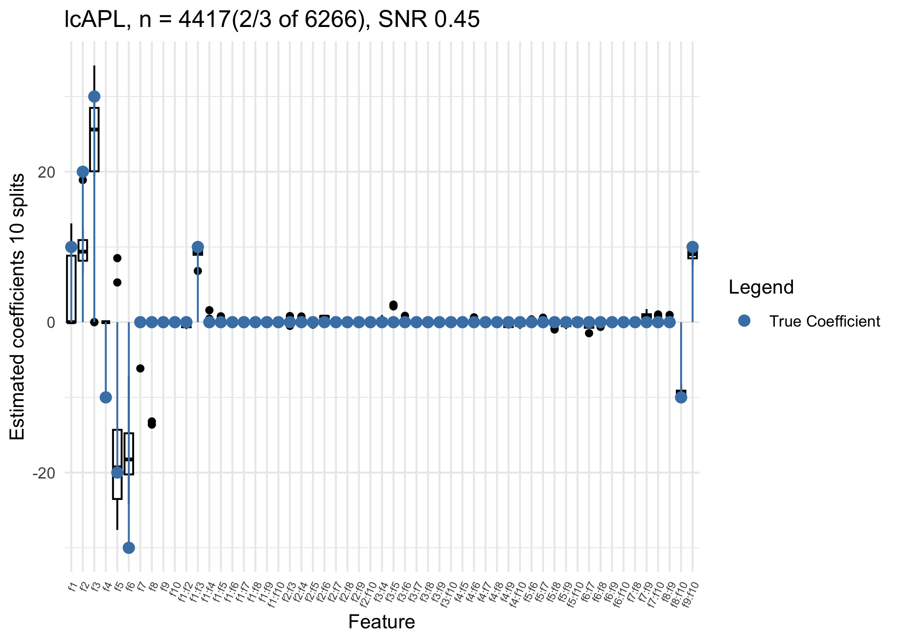<!-- -->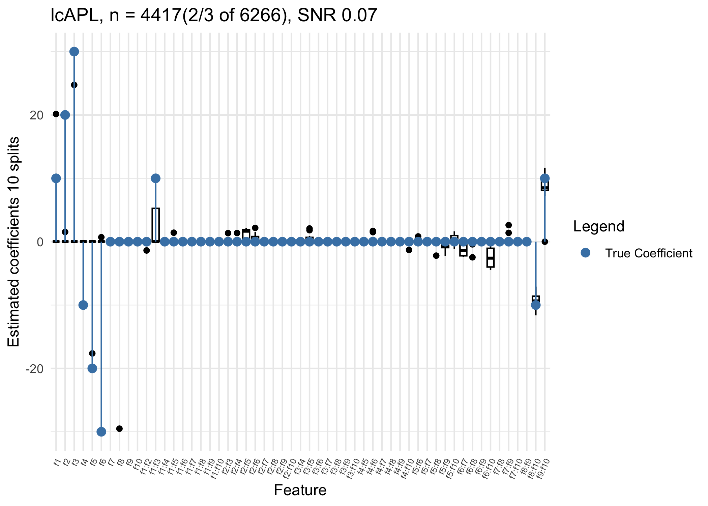<!-- -->

``` r
p = 10

features_to_plot <- c("f1", "f2", "f3", "f4", "f5", "f6", "f7", "f8", "f9", "f10", "f1:f3", "f8:f10", "f9:f10")
names(beta_main_int_all)[1:10] <- paste0("f", 1:10)

plt_coef <- list()
for(ii in seq(length(NF))) {
  
  # Reshape the data to long format using melt
  data_long <- melt(mod[[ii]]$beta_int_est_refit)
  
  # Filter data to include only the specified features
  data_long_filtered <- data_long[data_long$Var1 %in% features_to_plot, ]
  
  plt_coef[[ii]] <- ggplot(data_long_filtered, aes(x = as.factor(Var1), y = value)) +
    geom_boxplot(fill = "white", color = "black") +
    geom_segment(data = data.frame(x = 1:length(features_to_plot), y = beta_main_int_all[features_to_plot]), 
               aes(x=x, xend=x, y=0, yend=y), color="darkorange3") +
    geom_point(data = data.frame(x = 1:length(features_to_plot), y = beta_main_int_all[features_to_plot]), 
               aes(x, y, color = "True Coefficient"), 
               pch = 20, size = 3, alpha = 1) +
    labs(
      y = "Estimated coefficients 10 splits",
      title = paste0("lcAPL, n = 4417(2/3 of 6266), SNR ", round(snr,2)[ii]),
    ) +
    theme_minimal() +
    scale_x_discrete(name = "Feature") +
    scale_color_manual(values = c("True Coefficient" = "darkorange3"), name = "Legend") +
    guides(fill = guide_legend(title = "Boxplot")) + theme(legend.position="bottom")
}
  
plt_exp <- plt_coef[[1]] +  theme(axis.text.x = element_text( color="black", size=10),
          axis.text.y = element_text(color="black", 
                           size=10))
```

#### Lambda path

``` r
plt_path <- list()
library(ggplot2)

{par(mar=c(5,6,4,1)+.1)
  for(ii in seq(length(NF))){
   plt_path[[ii]] <- ggplot_path(
      slc_int = mod[[ii]]$fit, 
      cvslc_int = mod[[ii]]$cvfit, 
      main = paste0("SNR ", round(snr[ii], 2) ), r = 1,
      colnames_main_nz = paste0("f", as.character(1:6)),
      #colnames_int_nz =  c("f9:f10", "f1:f3", "f8:f10"),
      feature_names = rownames(mod[[ii]]$beta_est_refit),
      only_main = F, only_int = F)
  }
}


plt_path[[1]]
```

<!-- -->

``` r
plt_path <- list()
library(ggplot2)

{par(mar=c(5,6,4,1)+.1)
  for(ii in seq(length(NF))){
   plt_path[[ii]] <- ggplot_path(
      slc_int = mod[[ii]]$fit_int, 
      cvslc_int = mod[[ii]]$cvfit_int, 
      main = paste0("SNR ", round(snr[ii], 2) ), r = 1,
      colnames_main_nz = paste0("f", as.character(1:6)),
      colnames_int_nz =  c("f9:f10", "f1:f3", "f8:f10"),
      feature_names = rownames(mod[[ii]]$beta_int_est_refit),
      only_main = F, only_int = F)
  }
}

plt_1_export <- plt_path[[1]] + theme(legend.position = "none") + theme(axis.text.x = element_text( color="black", size=8),
          axis.text.y = element_text(color="black", 
                           size=8))

plt_path[[1]]
```

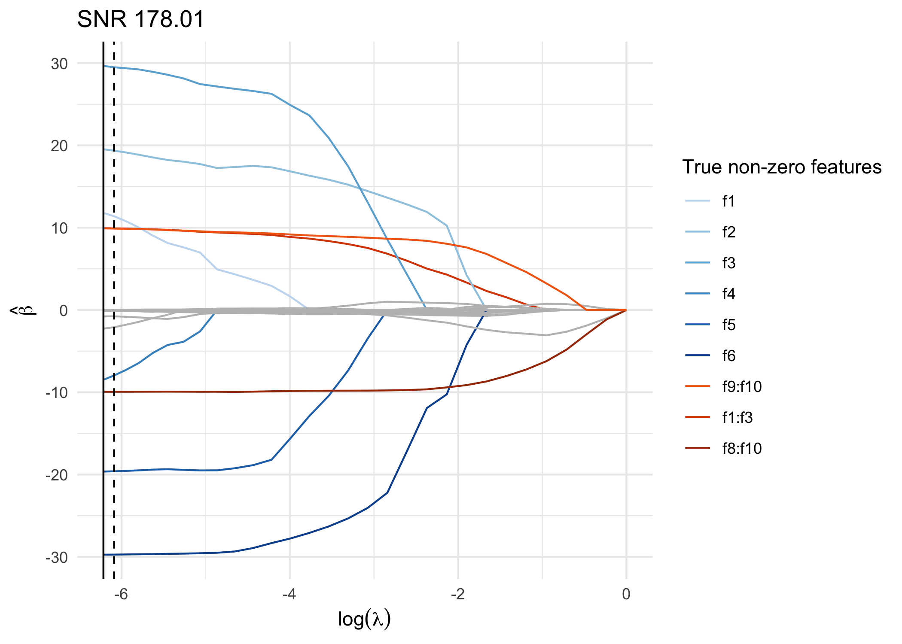<!-- -->

The interaction effects are captured well, but they may not be the first
ones to enter the model, and many very small spurious effects can also
get selected. However, this issue can be largely resolved through
refitting.

### Compare test and train error

SNR 178

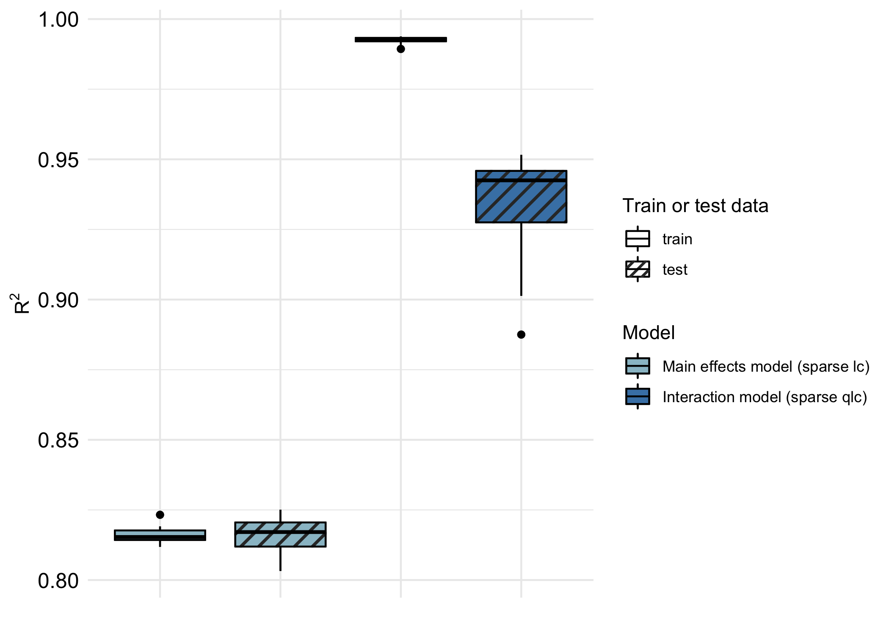<!-- -->

## Files written

These files have been written to the target directory,
`data/00-simulations-noise`:

``` r
projthis::proj_dir_info(path_target())
```

    ## # A tibble: 0 × 4
    ## # ℹ 4 variables: path <fs::path>, type <fct>, size <fs::bytes>,
    ## #   modification_time <dttm>
