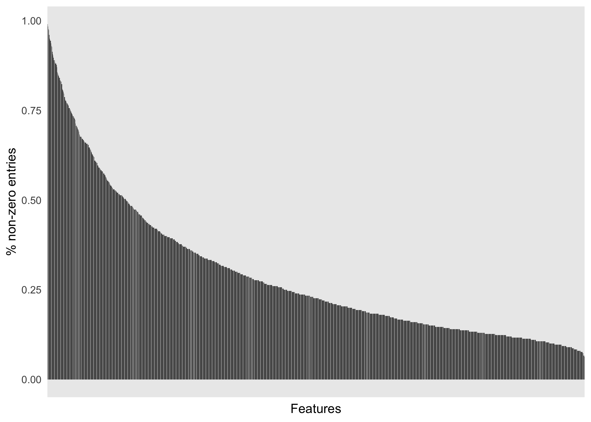
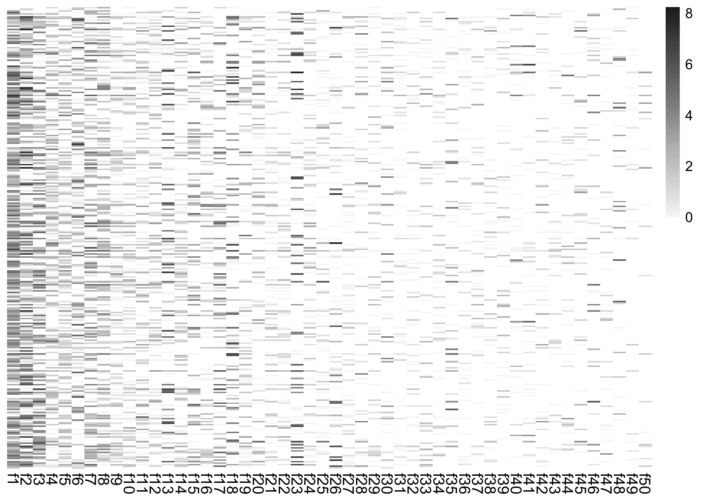
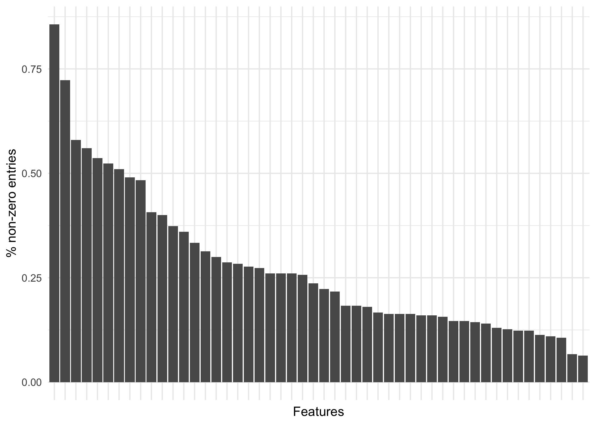
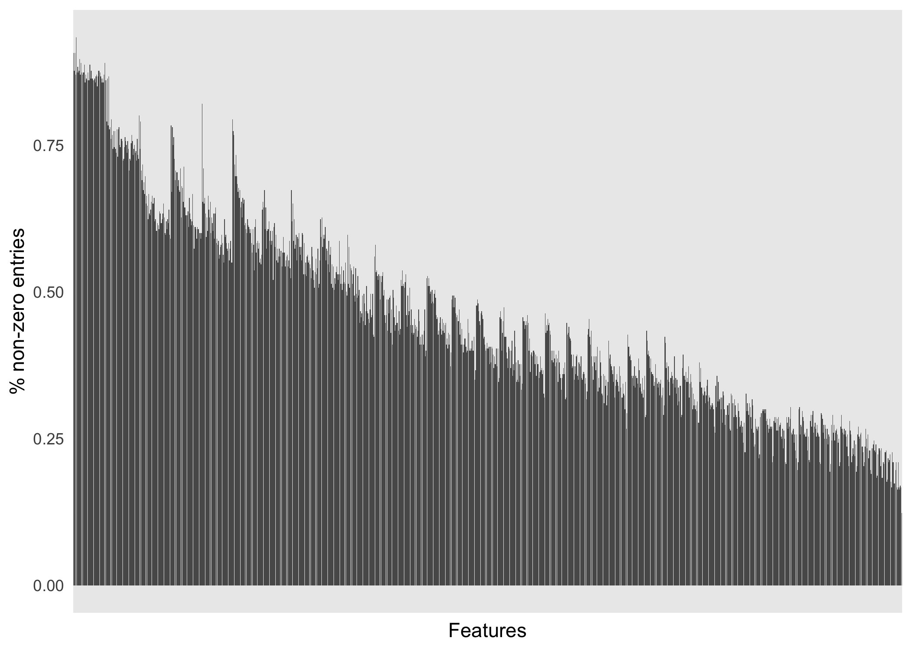
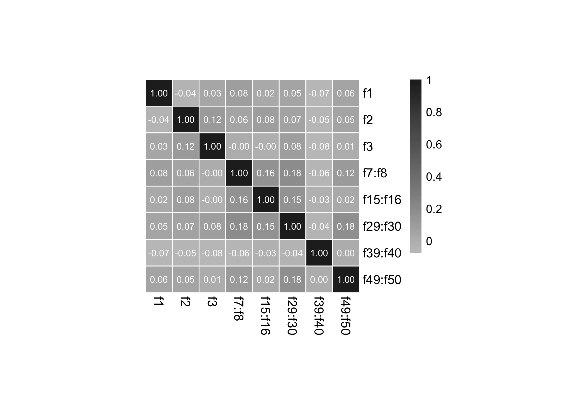
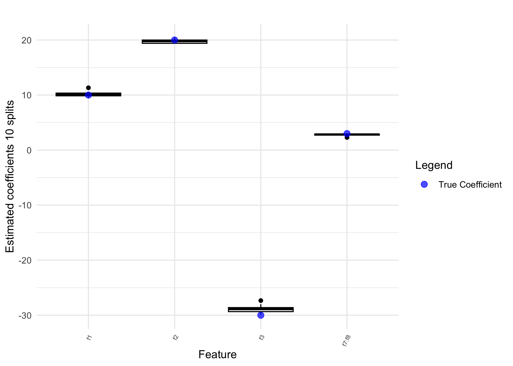
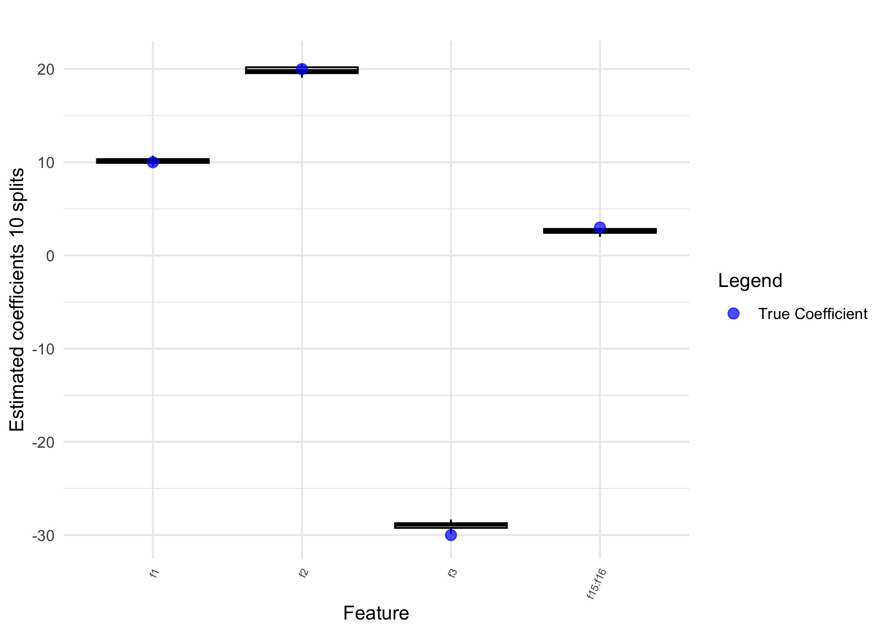
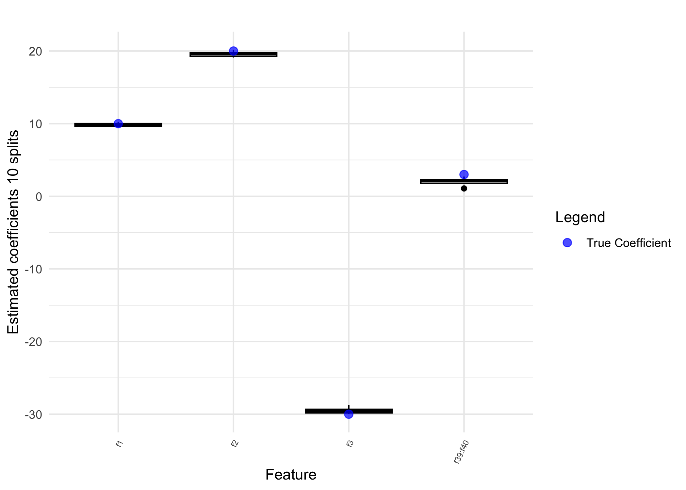

Semi-synthetic data example: Impact of sparsity
================
Compiled at 2024-04-27 12:11:45 UTC

#### Document overview

In this document we generate a synthetic outcome $y$ based on a
combination of linear and interaction effects from real 16s data from
the American Gut cohort.

We vary the position of the true (nonzero) interaction effects and show
under which conditions interactions can be identified.

#### Required packages and functions

``` r
library("conflicted")
library(trac)
library(ggplot2)
library(gridExtra)
library(RColorBrewer)
library(reshape2)
```

## 1. Synthetic data generation based on American gut data

``` r
## load data
## This dataset was processed and aggregated in 
## https://github.com/jacobbien/trac-reproducible.

path.data <- path.data <- "data/"


source("R/sparse_log_contrast.R")
source("R/slc_int.R")
source("R/slc_int_plots.R")
source("R/log-ratio-lasso_interactions.R")
source("R/utils.R")
```

``` r
dat_list <- readRDS(paste0(path.data, "AGP_aggregated.RDS"))
```

``` r
## extract OTU level
i = "OTU"
dat_OTU <- dat_list[[i]]
X_OTU <- dat_OTU$x 
y_BMI <- dat_OTU$y
dim(X_OTU)
```

    ## [1] 6266 1387

``` r
## subsample 100 samples to no be in the high-dim regime anymore 
set.seed(123)
subs_index <- sample(seq(nrow(X_OTU)), 300)
X_OTU <- X_OTU[subs_index, ]
dim(X_OTU)
```

    ## [1]  300 1387

Let’s check how sparse the features are and sort them by sparsity (from
dense to sparse).

``` r
sort_sparstiy <- order(colSums(X_OTU != 0)/nrow(X_OTU), decreasing = T)
X_OTU <- X_OTU[, sort_sparstiy]
colnames(X_OTU) <- paste0("f", 1:ncol(X_OTU))


library(ggplot2)
library(dplyr)

data.frame("Sparsity" = colSums(X_OTU != 0)/nrow(X_OTU),
           "Feature" = factor(colnames(X_OTU), levels = colnames(X_OTU)) ) %>% 
  ggplot(aes(x = Feature, y = Sparsity)) +
  geom_bar(stat="identity") +
  theme_minimal() +
  theme(axis.text.x=element_blank(), 
      axis.ticks.x=element_blank()
    ) +
  xlab("Features") + ylab("% non-zero entries")  
```

<!-- -->
For runtime reasons we subsample 80 features features from X.

``` r
X_OTU_init <- X_OTU
set.seed(123)
X_OTU <- X_OTU_init[, sort(sample(1:ncol(X_OTU_init), 50))]
X_OTU[, 49] <- X_OTU_init[, ncol(X_OTU_init) - 1]
X_OTU[, 50] <- X_OTU_init[, ncol(X_OTU_init)]

## rename again f1,...,f50
colnames(X_OTU) <- paste0("f", 1:50)
```

``` r
library(RColorBrewer)
set.seed(123)
subsample_viz <- sample(1:nrow(X_OTU), 300)
X_OTU_viz <- X_OTU#[subsample_viz, ]
X_OTU_viz[X_OTU_viz == 0] <- NA
heatmap_OTUs <- pheatmap::pheatmap(log(X_OTU_viz), cluster_cols = F, cluster_rows = F,
                   fontsize_row = 0.0001, na_col = "white", border_color = "white",
                   color = colorRampPalette((brewer.pal(n = 7, name =
  "Greys")))(100), fontsize_col = 11)
```

<!-- -->

``` r
data.frame("Sparsity" = colSums(X_OTU != 0)/nrow(X_OTU),
           "Feature" = factor(colnames(X_OTU), levels = colnames(X_OTU)) ) %>% 
  ggplot(aes(x = Feature, y = Sparsity)) +
  geom_bar(stat="identity") +
  theme_minimal() +
  theme(axis.text.x=element_blank(), 
      axis.ticks.x=element_blank()
    ) +
  xlab("Features") + ylab("% non-zero entries")
```

<!-- -->

### Transform data

``` r
## add pseudo count and build relative abundances
pseudo_count <- 1
X_OTU_psd <- as.matrix(X_OTU + pseudo_count)
X_OTU_rel <- X_OTU_psd/rowSums(X_OTU_psd)
```

``` r
## compute interactions 
X_OTU_interact <- compute.interactions.aitchison(X_OTU_rel)
```

``` r
data.frame("Sparsity" = colSums(X_OTU_interact != 0)/nrow(X_OTU_interact),
           "Feature" = factor(colnames(X_OTU_interact), 
                              levels = colnames(X_OTU_interact)) ) %>% 
  ggplot(aes(x = Feature, y = Sparsity)) +
  geom_bar(stat="identity") +
  theme_minimal() +
  theme(axis.text.x=element_blank(), 
      axis.ticks.x=element_blank()
    ) +
  xlab("Features") + ylab("% non-zero entries")
```

<!-- -->

### Generate semi-synthetic outcomes

In the first round we are choosing models with three main effects and
one interaction effect. We make sure the the interaction effect is not
correlated with the three main effects. We vary the position of the
interaction effects from dense to sparse interaction features.

define interactions

``` r
int_all <- c("f7:f8",
             "f15:f16",
             "f29:f30", 
             "f39:f40",
             "f49:f50")
```

Sparsity levels for selected interactions

``` r
df_sparse_int <- data.frame("Sparsity" = colSums(X_OTU_interact != 0)/nrow(X_OTU_interact),
           "Feature" = factor(colnames(X_OTU_interact), 
                              levels = colnames(X_OTU_interact)) )
df_sparse_int[which(df_sparse_int$Feature %in% int_all), ]
```

    ##          Sparsity Feature
    ## f7:f8   0.6400000   f7:f8
    ## f15:f16 0.4766667 f15:f16
    ## f29:f30 0.3266667 f29:f30
    ## f39:f40 0.2566667 f39:f40
    ## f49:f50 0.1233333 f49:f50

``` r
df_countSum_int <- data.frame("CountSum" = colSums(X_OTU_interact),
           "Feature" = factor(colnames(X_OTU_interact), 
                              levels = colnames(X_OTU_interact)) )
df_countSum_int[which(df_countSum_int$Feature %in% int_all), ]
```

    ##          CountSum Feature
    ## f7:f8   681.97745   f7:f8
    ## f15:f16 585.80579 f15:f16
    ## f29:f30 341.17023 f29:f30
    ## f39:f40 234.98968 f39:f40
    ## f49:f50  80.34728 f49:f50

Correlatedness among the one interaction feature and the three main
effects (should be uncorrelated!!)

``` r
cor_mat <- cor(cbind(X_OTU_rel[, c(1:3)], X_OTU_interact[, int_all]),
    use = "pairwise.complete.obs", method = "kendall")
cor_mat 
```

    ##                  f1          f2           f3       f7:f8      f15:f16
    ## f1       1.00000000 -0.04132794  0.032277854  0.07642381  0.023947445
    ## f2      -0.04132794  1.00000000  0.115178692  0.05689025  0.084939883
    ## f3       0.03227785  0.11517869  1.000000000 -0.00136846 -0.003996558
    ## f7:f8    0.07642381  0.05689025 -0.001368460  1.00000000  0.156341004
    ## f15:f16  0.02394744  0.08493988 -0.003996558  0.15634100  1.000000000
    ## f29:f30  0.05004989  0.07109223  0.079690542  0.18299774  0.154734264
    ## f39:f40 -0.06822066 -0.05404740 -0.077589212 -0.06118048 -0.025225818
    ## f49:f50  0.05854359  0.04641070  0.009209171  0.11750949  0.020115281
    ##             f29:f30      f39:f40     f49:f50
    ## f1       0.05004989 -0.068220659 0.058543592
    ## f2       0.07109223 -0.054047403 0.046410696
    ## f3       0.07969054 -0.077589212 0.009209171
    ## f7:f8    0.18299774 -0.061180483 0.117509491
    ## f15:f16  0.15473426 -0.025225818 0.020115281
    ## f29:f30  1.00000000 -0.039122286 0.176785147
    ## f39:f40 -0.03912229  1.000000000 0.001266897
    ## f49:f50  0.17678515  0.001266897 1.000000000

``` r
pheatmap::pheatmap(cor_mat, cluster_cols = F, cluster_rows = F,
                   color = colorRampPalette((brewer.pal(n = 7, name =
  "Greys")))(100)[30:100], border_color = "white", display_numbers = T,
  cellwidth = 23, cellheight = 23, number_color = "white",
  fontsize_col = 11, fontsize_row = 11)
```

<!-- -->

Mean correlation with main effects of absolute correlation values

``` r
mean_cor <- numeric(length(int_all))
names(mean_cor) <- int_all
for(i in int_all){
  mean_cor[i] <- round(max(abs(cor_mat[i, 1:3])), 2)
}

mean_cor
```

    ##   f7:f8 f15:f16 f29:f30 f39:f40 f49:f50 
    ##    0.08    0.08    0.08    0.08    0.06

Effect sizes

``` r
colSums(abs(X_OTU_interact[, int_all] * 10))
```

    ##     f7:f8   f15:f16   f29:f30   f39:f40   f49:f50 
    ## 6819.7745 5858.0579 3411.7023 2349.8968  803.4728

``` r
eff_size <- colSums(abs(X_OTU_interact[, int_all]))
```

``` r
## 3 nonzero main effects
beta_main <-  c(10, 20, -30) 
main_part = log(X_OTU_rel[, c(1:3)]) %*% beta_main


## One nonzero interaction effect
interaction_part <- list()
Y_sim_int <- list()
set.seed(123)
noise <- 10 * rnorm(nrow(X_OTU_rel))

i <- 0
for(m in int_all){
  i <- i + 1
  beta_interact = 3
  
  interaction_part[[i]] = X_OTU_interact[, m] * beta_interact
  Y_sim_int[[i]] <- 10 + main_part + interaction_part[[i]] + noise
  Y_sim_int[[i]] <- as.numeric(Y_sim_int[[i]])
}
```

``` r
n_m <- length(int_all)

slc_slc_int <- list()

for(i in 1:n_m) {
  print(paste("Model:", i))
  slc_slc_int[[i]] <- slc_slc_int_all_splits(X = as.matrix(X_OTU_rel),
                                                             y = Y_sim_int[[i]],
                                                             method = "regr", output = "raw",
                                             nbsplit = 10,
                                             #nbsplit = 5,
                                             ii = "i1se")
}
```

<!-- --><!-- --><!-- --><!-- --><!-- -->
\### How good are the models in terms of squared distances for the
different noise levels?

``` r
## True coefficients
p = ncol(X_OTU)

beta_main_all <- rep(0, p)
beta_main_all[c(1:3)] <- beta_main

beta_main_int_all <- matrix(nrow = p * (p + 1)/2, ncol = n_m)

rownames(beta_main_int_all) <- c(paste0("f", as.character(1:p)), colnames(X_OTU_interact))
for(i in 1:n_m){
  beta_main_int_all[c(paste0("f", as.character(1:3)), int_all[i]), i] <- c(beta_main, beta_interact)
}
beta_main_int_all[is.na(beta_main_int_all)] <- 0
beta_main_int_all[which(rowSums(beta_main_int_all) != 0), ]
```

    ##         [,1] [,2] [,3] [,4] [,5]
    ## f1        10   10   10   10   10
    ## f2        20   20   20   20   20
    ## f3       -30  -30  -30  -30  -30
    ## f7:f8      3    0    0    0    0
    ## f15:f16    0    3    0    0    0
    ## f29:f30    0    0    3    0    0
    ## f39:f40    0    0    0    3    0
    ## f49:f50    0    0    0    0    3

### True effects are only main effects

``` r
## Calculate squared distances
nsplit = 10

dist_nf_int <- matrix(nrow = nsplit, ncol = n_m)

for(i in 1:n_m){
  int_i <- int_all[i]
  ## extract beta estimates (1se) for each train-test split
  beta_est_int = slc_slc_int[[i]]$beta_int_est_refit
  #beta_est_int[abs(beta_est_int) < 5] <- 0
  #dist_nf_int[, i] = colSums(sqrt((beta_est_int - beta_main_int_all[, i])^2))
  dist_nf_int[, i] = sqrt((beta_est_int[int_i, ] - beta_main_int_all[int_i, i])^2)
  
}
colnames(dist_nf_int) <- int_all
```

``` r
# Assuming dist_nf_int is your matrix
# Convert the matrix to a data frame for ggplot
dist_nf_int_ <- dist_nf_int
colnames(dist_nf_int_) <- paste0(colnames(dist_nf_int),
                                " (", round(1- df_sparse_int[colnames(dist_nf_int), ]$Sparsity, 2), ")")

# Load the ggplot2 library
library(ggplot2)
dist_nf_int.l <- reshape2::melt(dist_nf_int_)
# Create the boxplot using ggplot
plt_esterr_sparsity <- dist_nf_int.l %>% ggplot(aes(x = Var2, y = value)) +
  geom_boxplot() +
  labs(title = "", y = expression("Estimation error"~~sqrt((theta[ "jk" ]^'*' - hat(theta)[ "jk" ])^2)), 
       x = expression("Model with non-zero interaction between feature"~italic("j")*":"*italic("k")~"(f"*italic("j")*":f"*italic("k")~") (sparsity)")
 ) +
  theme_minimal() + 
  theme(axis.text.x = element_text(colour="black"), 
        axis.ticks = element_line(color = "black")) #+ ylim(0, 25) 
plt_esterr_sparsity 
```

<!-- -->

``` r
summary(dist_nf_int)
```

    ##      f7:f8             f15:f16          f29:f30          f39:f40      
    ##  Min.   :0.002853   Min.   :0.0495   Min.   :0.2450   Min.   :0.2809  
    ##  1st Qu.:0.106161   1st Qu.:0.1567   1st Qu.:0.6036   1st Qu.:0.7288  
    ##  Median :0.153711   Median :0.3008   Median :0.8153   Median :0.8748  
    ##  Mean   :0.212306   Mean   :0.3851   Mean   :1.2729   Mean   :0.9560  
    ##  3rd Qu.:0.276804   3rd Qu.:0.5763   3rd Qu.:1.5299   3rd Qu.:1.2044  
    ##  Max.   :0.700707   Max.   :0.9901   Max.   :3.3270   Max.   :1.9184  
    ##     f49:f50      
    ##  Min.   :0.4626  
    ##  1st Qu.:0.7929  
    ##  Median :1.7777  
    ##  Mean   :1.8359  
    ##  3rd Qu.:3.0000  
    ##  Max.   :3.0000

``` r
apply(dist_nf_int, 2, var)
```

    ##      f7:f8    f15:f16    f29:f30    f39:f40    f49:f50 
    ## 0.03947979 0.08992400 1.14701729 0.21367269 1.22191166

``` r
apply(dist_nf_int, 2, median)
```

    ##     f7:f8   f15:f16   f29:f30   f39:f40   f49:f50 
    ## 0.1537111 0.3008346 0.8152818 0.8747844 1.7777251

### path

``` r
for(i in 1:5){
  plt_path <- ggplot_path(
  slc_int = slc_slc_int[[i]]$fit_int, 
  cvslc_int = slc_slc_int[[i]]$cvfit_int, 
  p = ncol(X_OTU),
  main = paste0("Model s=", i), r = 1,
  colnames_main_nz = paste0("f", as.character(1:3)),
  colnames_int_nz =  int_all[i], 
  feature_names = rownames(slc_slc_int[[i]]$beta_int_est_refit))

  if(i == 1){
  print(plt_path)
  }
}
```

<!-- -->

## Files written

These files have been written to the target directory,
`data/01-simulations-sparsity`:

``` r
projthis::proj_dir_info(path_target())
```

    ## # A tibble: 0 × 4
    ## # ℹ 4 variables: path <fs::path>, type <fct>, size <fs::bytes>,
    ## #   modification_time <dttm>
