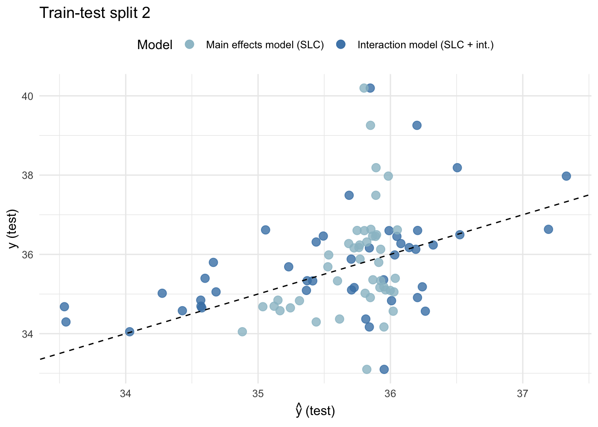

Tara ocean: sparse quadratic log-contrast modeling
================
Compiled at 2024-04-27 12:45:54 UTC

# Load Tara Ocean data

This dataset was processed and aggregated in
<https://github.com/jacobbien/trac-reproducible>.

``` r
path.data <- "data/"
source("R/sparse_log_contrast.R")
source("R/slc_int.R")
source("R/slc_int_plots.R")
source("R/log-ratio-lasso_interactions.R")
source("R/utils.R")
```

``` r
library(Matrix)
library(tidyverse)
#devtools::install_github("viettr/trac", dependencies = TRUE, ref = "prediction_during_cv")
library(trac)
library(reticulate)
library(ggplot2)
library(gridExtra)
library(ggpattern)
library(ggrepel)
```

``` r
dat_list <- readRDS(paste0(path.data, "tara_sal_processed_aggregated.RDS"))
```

# 1. SLC and SLC + int.

## Analysis on family level

30 most abundant families

``` r
## extract family level
i = "Family"
dat_family <- dat_list[[i]]
X_family <- dat_family$x 
y_sal <- dat_family$y
dim(X_family)
```

    ## [1]  136 1869

``` r
## keep 30 most abundant families
abund <- colSums(X_family > 0)
X_family <- X_family[, order(abund, decreasing = T)[1:30]]
dim(X_family)
```

    ## [1] 136  30

``` r
rename_X <- stringr::str_split(colnames(X_family), "::")
rename_X <- sapply(rename_X,tail,1)
colnames(X_family) <- rename_X
```

### Make sure that names have no blanks or “-”

``` r
colnames(X_family) <- gsub(" ", "", colnames(X_family))
colnames(X_family) <- gsub("_", "", colnames(X_family))
colnames(X_family) <- gsub("-", "", colnames(X_family))
```

``` r
pseudo_count <- 1
X_family_psd <- as.matrix(X_family + pseudo_count)
X_family_rel <- X_family_psd/rowSums(X_family_psd)
```

### Fit SLC and SLC + int model

``` r
slc_slc_int_family <- slc_slc_int_all_splits(X = as.matrix(X_family_rel),
                                             y = y_sal,
                                             method = "regr", output = "raw")
```

### Compare test and train error

<!-- -->

``` r
sum_mat <- rbind(c(mean(train_mse_slc), sd(train_mse_slc)),
                 c(mean(test_mse_slc), sd(test_mse_slc)),
                 c(mean(train_mse_slc_int), sd(train_mse_slc_int)),
                 c(mean(test_mse_slc_int), sd(test_mse_slc_int)))
colnames(sum_mat) <- c("mean MSE", "sd MSE")
sum_mat <- as.data.frame(sum_mat)
sum_mat$model <- c("main-train", "main-test", "int-train", "int-test")
sum_mat$rank <- i
```

``` r
plt <- list()
for(r in 1:10){
  
  yhat_tebest <- slc_slc_int_family$yhat_te[[r]][, slc_slc_int_family$cvfit[[r]]$cv$i1se]
  yhat_te_intbest <- slc_slc_int_family$yhat_te_int[[r]][, slc_slc_int_family$cvfit[[r]]$cv$i1se]
  
  
  # Create a data frame with the relevant variables
  data <- data.frame(
    yhat_tebest = yhat_tebest,
    yhat_te_intbest = yhat_te_intbest,
    y = y[-slc_slc_int_family$tr[[r]]]  
  )
  
  # Create a scatter plot using ggplot2
  plt[[r]] <- ggplot(data, aes(x = yhat_tebest, y = y)) +
    
    geom_point(data = data, aes(x = yhat_te_intbest, y = y, color = "Interaction model (SLC + int.)"), alpha = 0.8, size = 3) +
    geom_point(aes(color = "Main effects model (SLC)"), alpha = 0.8, size = 3) +
    geom_abline(intercept = 0, slope = 1, linetype = "dashed", color = "black") +
    labs(title = paste("Train-test split", r),
         x = expression(hat(y)~"(test)"), y = "y (test)") +
    theme_minimal() +
    scale_color_manual(
      values = c("Main effects model (SLC)" = "lightblue3",
                 "Interaction model (SLC + int.)" = "steelblue"),
      name = "Model",
      limits = c("Main effects model (SLC)", "Interaction model (SLC + int.)")
    ) +
    theme(legend.position = "top", legend.justification = "center")
  
  
  
  
} 

plt[[2]]
```

<!-- -->

### Plot coefficients

only show coefficients with a nonzero mean estimate.

Main + interaction effects (SLC + int.)

``` r
median_values$group[median_values$value != 0]
```

    ## [1] "ChesapeakeDelawareBay  (Order: SAR11 clade)"                   
    ## [2] "ChesapeakeDelawareBay  (Order: SAR11 clade):Bacteriovoracaceae"
    ## [3] "f13  (Order: SAR11 clade):f96  (Order: SAR11 clade)"           
    ## [4] "f13  (Order: SAR11 clade):S25593  (Order: Rickettsiales)"      
    ## [5] "f40  (Order: SAR11 clade):f96  (Order: SAR11 clade)"           
    ## [6] "f55  (Order: SAR11 clade):Sphingomonadaceae"                   
    ## [7] "f8  (Order: SAR11 clade):f13  (Order: SAR11 clade)"            
    ## [8] "f8  (Order: SAR11 clade):f60  (Order: SAR11 clade)"            
    ## [9] "S25593  (Order: Rickettsiales):Oceanospirillaceae"

## Files written

These files have been written to the target directory,
`data/02-tara-ocean-interactions`:

``` r
projthis::proj_dir_info(path_target())
```

    ## # A tibble: 0 × 4
    ## # ℹ 4 variables: path <fs::path>, type <fct>, size <fs::bytes>,
    ## #   modification_time <dttm>
