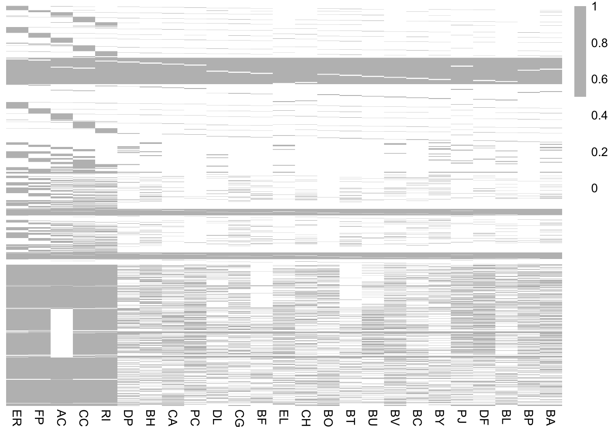
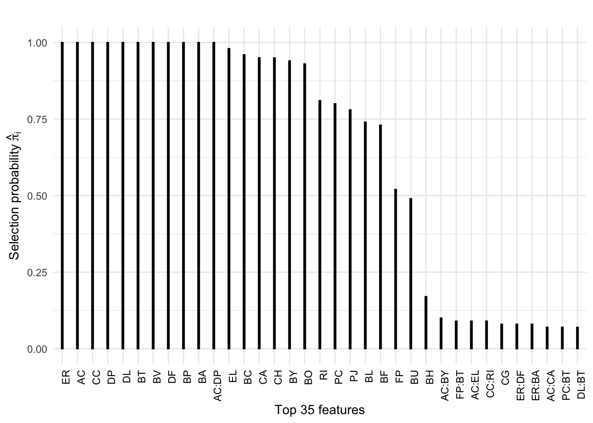
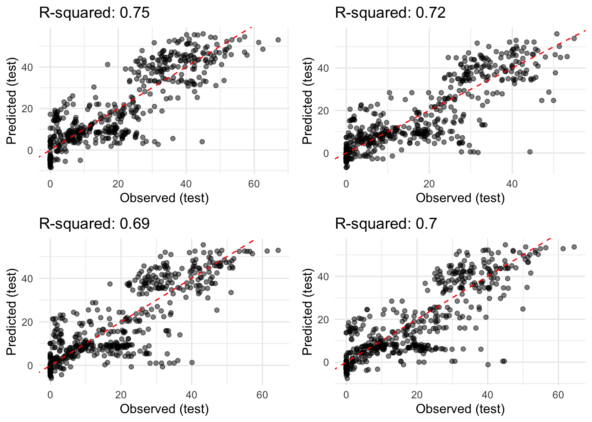
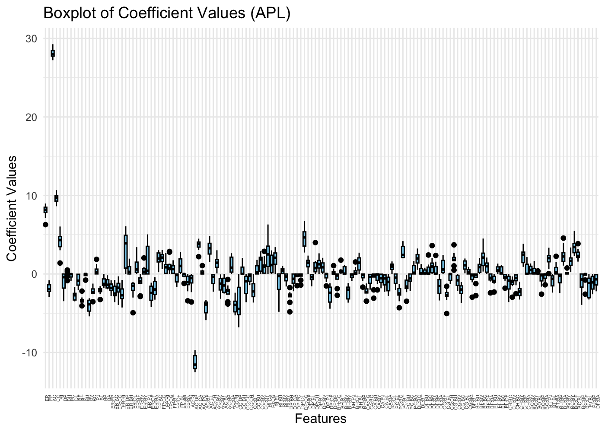
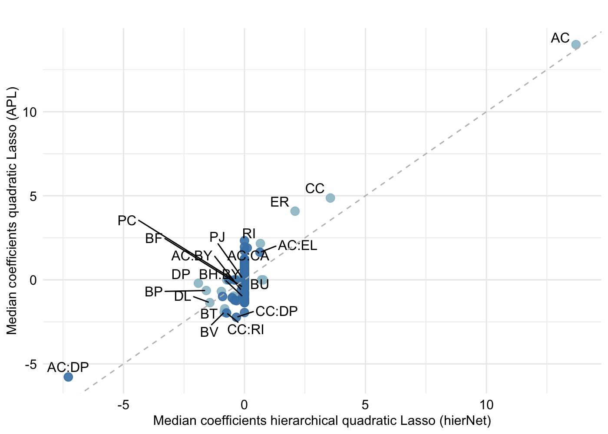

Butyrate production: sparse quadratic interaction model
================
Compiled at 2024-04-27 13:05:39 UTC

### Import data

The data was imported from:
<https://github.com/abbyskwara2/regression_on_landscapes>

``` r
butyrate <- read.csv("data/butyrate.csv")
y <- butyrate$fitness
X <- butyrate[, 1 : (ncol(butyrate) - 1)]

dim(X)
```

    ## [1] 1561   25

### Plot Design matrix B

``` r
pheatmap(X, cluster_rows = F, cluster_cols = F, color = c("white", "grey"),
         fontsize_row = 0.001)
```

<!-- -->

### Compute interactions

``` r
X <- as.matrix(X)
X_interactions <- cbind(X, hierNet::compute.interactions.c(X, diagonal = F)) 
dim(X_interactions)
```

    ## [1] 1561  325

``` r
ggplot(data = data.frame(value = y), aes(x = value)) +
  geom_histogram(binwidth = (max(y) - min(y))/100, fill = "white", color = "black") +
  labs(title = "Histogram of y",
       x = "y Values",
       y = "Frequency") + theme_minimal()
```

<!-- -->

## HierNet for binary input data

``` r
fit.weak.butyrate <- hiernet.stabsel.all(X = X, Y = as.matrix(y),
                                            selection_probability = 0.6)
```

``` r
# Sort the 'max' column in descending order and select the top 40 values
top_values <- head(sort(fit.weak.butyrate[[1]]$max, decreasing = TRUE), 35)

# Create a data frame for plotting
data <- data.frame(x = names(top_values), y = top_values)
data$x <- factor(data$x, levels = data$x)
# Create the bar plot using ggplot2
sel_prob_barplot <- ggplot(data, aes(x = x, y = y)) +
  geom_bar(stat = "identity", colour="black", fill="black", width=0.1) +
  labs(x = "Top 35 features", y =  expression(paste("Selection probability ",
                                                    hat(pi)[i])), 
       title = "") +
  theme_minimal() +
  theme(axis.text.x = element_text(angle = 90, hjust = 1, color = "black"))
sel_prob_barplot
```

<!-- -->

    ## [1] 325  10

``` r
# Convert matrix to data frame for ggplot
coef_df <- data.frame(coef_mat_allsplits)

# Get the indices of features with median absolute coefficient values greater than 0
selected_features <- which(apply(coef_mat_allsplits, 2, function(x) median(abs(x)) > 0))

# Reshape the data for ggplot2 using melt, preserving ":" character in feature names
coef_df_melted <- melt(coef_df[, selected_features])
```

    ## No id variables; using all as measure variables

``` r
coef_df_melted$variable <- gsub("\\.", ":", coef_df_melted$variable)

coef_df_melted$variable <- factor(coef_df_melted$variable,
    levels = colnames(coef_mat_allsplits),ordered = TRUE)

# Create boxplot using ggplot2
ggplot(coef_df_melted, aes(x = variable, y = value)) +
  geom_boxplot(fill = "skyblue", color = "black") +
  labs(title = "Boxplot of Coefficient Values (hierNet)",
       x = "Features",
       y = "Coefficient Values") +
  theme_minimal() +
  theme(axis.text.x = element_text(angle = 45, hjust = 1))
```

<!-- -->

``` r
# Create a list to store ggplot objects
plots_list <- list()

# Loop through each element in the sequence
for (r in seq(nsplit)) {
  
  # Create a data frame for the current iteration
  plot_data <- data.frame(Observed = y[-tr[[r]]], Predicted = yhat_te[[r]])
  
  # Create a ggplot object for the current iteration
  current_plot <- ggplot(plot_data, aes(x = Observed, y = Predicted)) +
    geom_point(alpha = .5) +
    geom_abline(intercept = 0, slope = 1, linetype = "dashed", color = "red") +
    labs(x = "Observed (test)", y = "Predicted (test)", 
         title = paste("R-squared:", round(rsq(y[-tr[[r]]], yhat_te[[r]]), 2))) +
    theme_minimal()
  
  # Add the ggplot object to the list
  plots_list[[r]] <- current_plot
}

# Arrange all ggplot objects in a grid
grid.arrange(grobs = plots_list[1:4], ncol = 2)  
```

<!-- -->

# All-pairs lasso

``` r
fit.glmnet <- list()
cvfit.glmnet<- list()
yhat_tr.glmnet <- list()
yhat_te.glmnet <- list()
Xall <- cbind(X, zz_binary)

for(r in seq(nsplit)){
  fit.glmnet[[r]] <- glmnet(Xall[tr[[r]], ], y[tr[[r]]])
  cvfit.glmnet[[r]] <- cv.glmnet(Xall[tr[[r]], ], y[tr[[r]]])
  yhat_tr.glmnet[[r]] <- predict(cvfit.glmnet[[r]], newx = Xall[tr[[r]], ], s = "lambda.min")
  yhat_te.glmnet[[r]] <- predict(cvfit.glmnet[[r]], newx = Xall[-tr[[r]], ], s = "lambda.min")
}
p = ncol(X)
coef_mat_allsplits.glmnet <- matrix(nrow = p * (p - 1) /2 + p, ncol = nsplit)
for(r in seq(nsplit)){
  coef_mat_allsplits.glmnet[, r] <- coef(cvfit.glmnet[[r]], s = "lambda.min")[-1]

}

rownames(coef_mat_allsplits.glmnet) <- colnames(coef_mat_allsplits)
coef_mat_allsplits.glmnet <- t(coef_mat_allsplits.glmnet)
```

``` r
# Convert matrix to data frame for ggplot
coef_df <- data.frame(coef_mat_allsplits.glmnet)

# Get the indices of features with median absolute coefficient values greater than 0
selected_features <- which(apply(coef_mat_allsplits.glmnet, 2, function(x) median(abs(x)) > 0))

# Reshape the data for ggplot2 using melt, preserving ":" character in feature names
coef_df_melted <- melt(coef_df[, selected_features])
```

    ## No id variables; using all as measure variables

``` r
coef_df_melted$variable <- gsub("\\.", ":", coef_df_melted$variable)

coef_df_melted$variable <- factor(coef_df_melted$variable,
    levels = colnames(coef_mat_allsplits.glmnet),ordered = TRUE)
# Create boxplot using ggplot2
ggplot(coef_df_melted, aes(x = variable, y = value)) +
  geom_boxplot(fill = "skyblue", color = "black") +
  labs(title = "Boxplot of Coefficient Values (APL)",
       x = "Features",
       y = "Coefficient Values") +
  theme_minimal() +
  theme(axis.text.x = element_text(angle = 90, hjust = 1, size = 4))
```

<!-- -->

``` r
# Create a list to store ggplot objects
plots_list <- list()

# Loop through each element in the sequence
for (r in seq(nsplit)) {
  
  # Create a data frame for the current iteration
  plot_data <- data.frame(Observed = y[-tr[[r]]], Predicted = yhat_te.glmnet[[r]])
  colnames(plot_data)[2] <- "Predicted"
  # Create a ggplot object for the current iteration
  current_plot <- ggplot(plot_data, aes(x = Observed, y = Predicted)) +
    geom_point(alpha = .5) +
    geom_abline(intercept = 0, slope = 1, linetype = "dashed", color = "red") +
    labs(x = "Observed (test)", y = "Predicted (test)", 
         title = paste("R-squared:", round(rsq(y[-tr[[r]]], yhat_te.glmnet[[r]]), 2))) +
    theme_minimal()
  
  # Add the ggplot object to the list
  plots_list[[r]] <- current_plot
}

# Arrange all ggplot objects in a grid
grid.arrange(grobs = plots_list[1:4], ncol = 2)  
```

<!-- -->

Scatterplot coef. hierNet vs. APL

<!-- -->

## Files written

These files have been written to the target directory,
`data/03-clark-butyrate-interactions`:

``` r
projthis::proj_dir_info(path_target())
```

    ## # A tibble: 0 × 4
    ## # ℹ 4 variables: path <fs::path>, type <fct>, size <fs::bytes>,
    ## #   modification_time <dttm>
