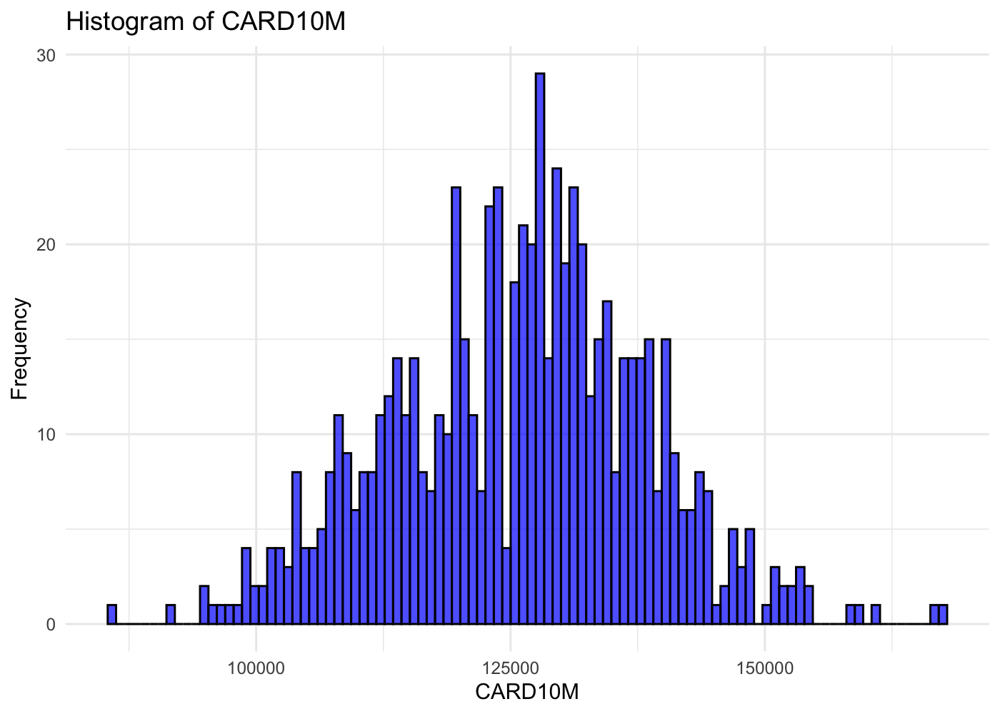
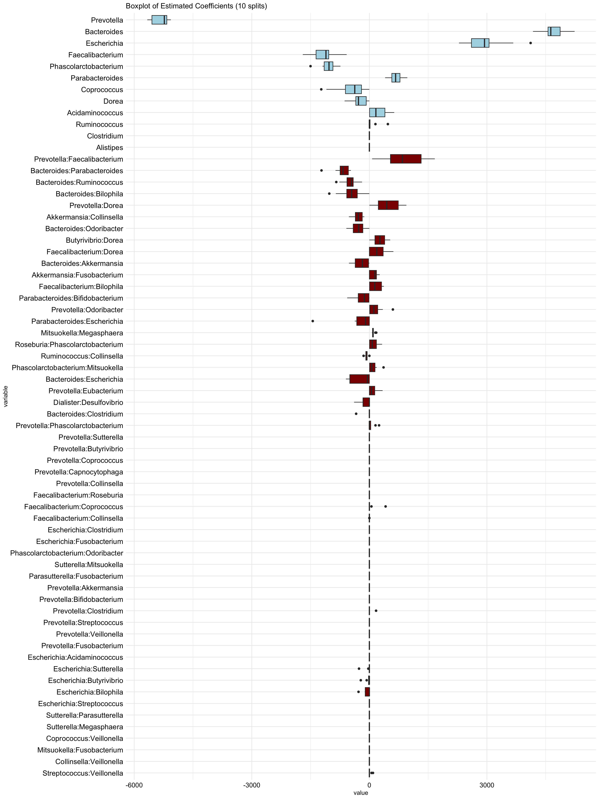

04a-ARGs-interactions-absolute
================
Compiled at 2025-02-17 07:58:52 UTC

The data was imported from the data resources in:
<https://www.nature.com/articles/s41586-021-04177-9#data-availability>

``` r
library("conflicted")
library(dplyr)
library(tidyr)
library(textshape)
library(ggplot2)
library(hierNet)
library(gridExtra)
library(glmnet)
library(RColorBrewer)
```

### Read data

``` r
path_data <- "data/"
mOTU_all <- readRDS(paste0(path_data, "mOTU_all.rds"))
meta_all <- readRDS(paste0(path_data, "Metadata_all.rds"))

str(mOTU_all)
```

    ## List of 7
    ##  $ Domain : num [1:1818, 1:3] 25268379 0 0 0 0 ...
    ##   ..- attr(*, "dimnames")=List of 2
    ##   .. ..$ : chr [1:1818] "M0_x10MCx1134" "M0_x10MCx1135" "M0_x10MCx1138" "M0_x10MCx1140" ...
    ##   .. ..$ : chr [1:3] "Archaea" "Bacteria" "unclassified"
    ##  $ Phylum : num [1:1818, 1:33] 0 0 0 0 0 0 0 0 0 0 ...
    ##   ..- attr(*, "dimnames")=List of 2
    ##   .. ..$ : chr [1:1818] "M0_x10MCx1134" "M0_x10MCx1135" "M0_x10MCx1138" "M0_x10MCx1140" ...
    ##   .. ..$ : chr [1:33] "Acidobacteria" "Actinobacteria" "Aquificae" "Bacteroidetes" ...
    ##  $ Class  : num [1:1818, 1:54] 0 0 0 0 0 0 0 0 0 0 ...
    ##   ..- attr(*, "dimnames")=List of 2
    ##   .. ..$ : chr [1:1818] "M0_x10MCx1134" "M0_x10MCx1135" "M0_x10MCx1138" "M0_x10MCx1140" ...
    ##   .. ..$ : chr [1:54] "Acidobacteria" "Actinobacteria__class_" "Alphaproteobacteria" "Anaerolineae" ...
    ##  $ Order  : num [1:1818, 1:114] 0 0 0 0 0 0 0 0 0 0 ...
    ##   ..- attr(*, "dimnames")=List of 2
    ##   .. ..$ : chr [1:1818] "M0_x10MCx1134" "M0_x10MCx1135" "M0_x10MCx1138" "M0_x10MCx1140" ...
    ##   .. ..$ : chr [1:114] "Acholeplasmatales" "Acidilobales" "Acidimicrobiales" "Acidithiobacillales" ...
    ##  $ Family : num [1:1818, 1:246] 0 0 0 0 0 0 0 0 0 0 ...
    ##   ..- attr(*, "dimnames")=List of 2
    ##   .. ..$ : chr [1:1818] "M0_x10MCx1134" "M0_x10MCx1135" "M0_x10MCx1138" "M0_x10MCx1140" ...
    ##   .. ..$ : chr [1:246] "Acetobacteraceae" "Acholeplasmataceae" "Acidaminococcaceae" "Acidilobaceae" ...
    ##  $ Genus  : num [1:1818, 1:710] 0 0 0 0 0 0 0 0 0 0 ...
    ##   ..- attr(*, "dimnames")=List of 2
    ##   .. ..$ : chr [1:1818] "M0_x10MCx1134" "M0_x10MCx1135" "M0_x10MCx1138" "M0_x10MCx1140" ...
    ##   .. ..$ : chr [1:710] "_Bacteroides_" "_Cellvibrio_" "_Clostridium_" "_Eubacterium_" ...
    ##  $ Species: num [1:1818, 1:1938] 0 0 0 0 0 0 0 0 0 0 ...
    ##   ..- attr(*, "dimnames")=List of 2
    ##   .. ..$ : chr [1:1818] "M0_x10MCx1134" "M0_x10MCx1135" "M0_x10MCx1138" "M0_x10MCx1140" ...
    ##   .. ..$ : chr [1:1938] "_Bacteroides__pectinophilus" "_Cellvibrio__gilvus" "_Clostridium__bartlettii" "_Clostridium__difficile" ...

``` r
## extract genus level and adjust names
mOTU_genus <- mOTU_all$Genus
rownames(mOTU_genus) <- substr(rownames(mOTU_genus), 4, nchar(rownames(mOTU_genus)))

mOTU_genus[1:5, 1:5]
```

    ##            _Bacteroides_ _Cellvibrio_ _Clostridium_ _Eubacterium_
    ## x10MCx1134             0            0       3687231             0
    ## x10MCx1135             0            0       5313951             0
    ## x10MCx1138             0            0             0             0
    ## x10MCx1140             0            0      21581161             0
    ## x10MCx1143             0            0             0             0
    ##            _Ruminococcus_
    ## x10MCx1134     3158547431
    ## x10MCx1135      336839421
    ## x10MCx1138      208437127
    ## x10MCx1140      682029749
    ## x10MCx1143      413187394

1.  Remove samples with missing data in the metadata

``` r
dim(meta_all)
```

    ## [1] 2173  243

Read ARG data and add it to meta data

``` r
arg_df <- read.table(paste0(path_data, "hub.microbiome.summary.down.10000000.r"), sep='\t')
arg_df <- arg_df %>% 
  pivot_wider(id_cols = "SampleID", names_from="Feature", values_from = "FeatureValue") %>% 
  select(SampleID, CARD10M) # For now only interested in ARGs

head(arg_df)
```

    ## # A tibble: 6 × 2
    ##   SampleID   CARD10M
    ##   <chr>        <dbl>
    ## 1 x20MCx2508  118088
    ## 2 x10MCx3076  106544
    ## 3 x30MCx2303  118960
    ## 4 x30MCx2933  133495
    ## 5 x20MCx2635  115226
    ## 6 x30MCx3237  125620

``` r
meta_arg <- meta_all %>% 
  tibble::rownames_to_column("SampleID") %>% 
  left_join(arg_df, by="SampleID") %>% 
  tibble::column_to_rownames("SampleID")
meta_all <- meta_arg
```

``` r
meta_all.f = meta_all[complete.cases(meta_all),]
dim(meta_all.f)
```

    ## [1] 702 244

``` r
ind_genus = intersect(rownames(meta_all.f), rownames(mOTU_genus))
length(ind_genus)
```

    ## [1] 690

``` r
dim(mOTU_genus)
```

    ## [1] 1818  710

``` r
## only merged / intersection
meta_all.f.m <- meta_all.f[ind_genus, ]
mOTU_genus.m <- mOTU_genus[ind_genus, ]

dim(meta_all.f.m)
```

    ## [1] 690 244

``` r
dim(mOTU_genus.m)
```

    ## [1] 690 710

2.  Remove covariates with only zeros

``` r
sum(colSums(meta_all.f.m!= 0) == 0)
```

    ## [1] 42

``` r
meta_all.f.m = meta_all.f.m[, colSums(meta_all.f.m!= 0) > 0]
```

``` r
# Convert the matrix to a data frame
meta_all_f_m_df <- as.data.frame(meta_all.f.m)

# Extract the column named "CARD10M"
card10m_column <- meta_all_f_m_df$CARD10M

# Create a histogram using ggplot2
ggplot(meta_all_f_m_df, aes(x = card10m_column)) +
  geom_histogram(bins = 100, fill = "blue", color = "black", alpha = 0.7) +
  labs(title = "Histogram of CARD10M",
       x = "CARD10M",
       y = "Frequency") +
  theme_minimal()
```

<!-- -->

### scale filtered & merged meta data:

``` r
meta_all.f.m.sc <- scale(meta_all.f.m)
```

Let’s take into account the 30 most prevalent genera, remove
“unclassified”:

``` r
order_abund <- order(colSums(mOTU_genus.m), decreasing = T)
X <- mOTU_genus.m[, order_abund[2:33]]
## remove duplicates
X <- X[, !grepl("^_", colnames(X))]
```

As y we choose the number of ARGs

``` r
y <- meta_all.f.m$CARD10M
#y <- meta_all.f.m$DOSAGE_METFORMIN_C
names(y) <- rownames(meta_all.f.m)
all(names(y) == rownames(X))
```

    ## [1] TRUE

``` r
rsq <- function (x, y) cor(x, y) ^ 2
```

## Linear Lasso model

``` r
fit.glmnet.lin <- list()
cvfit.glmnet.lin <- list()
yhat_tr.glmnet.lin <- list()
yhat_te.glmnet.lin <- list()
Xall.lin <- X

tr <- list()
ntot <- length(y)
p <- ncol(X)
n <- round(2/3 * ntot)
nsplit = 10

set.seed(123)
Xm <- X + 0.00001 * matrix(rnorm(length(X)), nrow = nrow(X), ncol = ncol(X))
for(r in seq(nsplit)){
  set.seed(r)
  tr[[r]] <- sample(ntot, n)
  xtr <- Xm[tr[[r]], ]
  xte <- Xm[-tr[[r]], ] 
  ## standardize X:
  xtr <- scale(xtr, TRUE, TRUE)
  ## standardize the testset X in the same way that it was in training:
  xte <- scale(xte, center = attr(xtr, "scaled:center"), 
               scale = attr(xtr, "scaled:scale"))
  

  Xalltr.lin <- xtr
  Xallte.lin <- xte
  
  fit.glmnet.lin[[r]] <- glmnet(Xalltr.lin, y[tr[[r]]], standardize = F)
  cvfit.glmnet.lin[[r]] <- cv.glmnet(Xalltr.lin, y[tr[[r]]], nfolds = 5, standardize = F)
  yhat_tr.glmnet.lin[[r]] <- predict(cvfit.glmnet.lin[[r]], newx = Xalltr.lin, 
                                 s = "lambda.min", standardize = F)
  yhat_te.glmnet.lin[[r]] <- predict(cvfit.glmnet.lin[[r]], newx = Xallte.lin, 
                                 s = "lambda.min", standardize = F)
}
```

``` r
Rsq.lin <- c()
for(r in seq(nsplit)){
  Rsq.lin[r] <- rsq(y[-tr[[r]]], as.vector(yhat_te.glmnet.lin[[r]]))
}
mean(Rsq.lin)
```

    ## [1] 0.4887972

``` r
list_plt_glmnet <- list()
list_plt_glmnet.lin <- list()

for (r in seq(nsplit)) {
  data <- data.frame(Observed = y[-tr[[r]]], Predicted = as.vector(yhat_te.glmnet.lin[[r]]))
  
  list_plt_glmnet.lin[[r]] <- ggplot(data, aes(y = Observed, x = Predicted)) +
    geom_point(alpha = 0.7, size = 2) +  # Set alpha for transparency
    geom_abline(intercept = 0, slope = 1, color = "grey", linetype = "dashed") +
    labs(title = paste0("Quadratic Lasso (APL): train-test split ", r),
         x = "Predicted number of ARGs (test set)", y = "Observed number of ARGs (test set)") +
    theme_minimal() + xlim(range(c(data$Observed, data$Predicted)))+ 
    theme(axis.text = element_text(color = "black", size = 12), 
          axis.title.y = element_text(color = "black", size = 12),                                            
          axis.title.x = element_text(color = "black", size = 12)
          )
}

# Arrange the ggplots in a single row
# grid.arrange(grobs = list_plt_glmnet[1:2], ncol = 2)
# plt.save <- list_plt_glmnet.lin[[9]] + xlim(90000, 150000)

# ggsave(paste0(path, "scatterplt_ARG_lin.png"), plt.save, height = 3.5, width = 4)
```

## All pairs-lasso

``` r
fit.glmnet <- list()
cvfit.glmnet<- list()
yhat_tr.glmnet <- list()
yhat_te.glmnet <- list()
Xall <- cbind(X, hierNet::compute.interactions.c(X, diagonal = F)) 

tr <- list()
ntot <- length(y)
p <- ncol(X)
n <- round(2/3 * ntot)
nsplit = 10

set.seed(123)
Xm <- X + 0.00001 * matrix(rnorm(length(X)), nrow = nrow(X), ncol = ncol(X))
for(r in seq(nsplit)){
  set.seed(r)
  tr[[r]] <- sample(ntot, n)
  xtr <- Xm[tr[[r]], ] 
  xte <- Xm[-tr[[r]], ] 
  ## standardize X:
  xtr <- scale(xtr, TRUE, TRUE)
  ## standardize the testset X in the same way that it was in training:
  xte <- scale(xte, center = attr(xtr, "scaled:center"), 
               scale = attr(xtr, "scaled:scale"))
  ## use the scaled X to form the interactions, then center xtr_int:
  xtr_int <- scale(hierNet::compute.interactions.c(xtr, diagonal = F), scale = F)
  ## use the scaled X to form the interactions, and then center the interactions
  ## in the same way they were in training:
  xte_int <- scale(hierNet::compute.interactions.c(xte, diagonal = F), 
                   center = attr(xtr_int, "scaled:center"), scale = F)

  Xalltr <- cbind(xtr, xtr_int) 
  Xallte <- cbind(xte,xte_int) 
  
  fit.glmnet[[r]] <- glmnet(Xalltr, y[tr[[r]]], standardize = F)
  cvfit.glmnet[[r]] <- cv.glmnet(Xalltr, y[tr[[r]]], nfolds = 5, standardize = F)
  yhat_tr.glmnet[[r]] <- predict(cvfit.glmnet[[r]], newx = Xalltr, 
                                 s = "lambda.min", standardize = F)
  yhat_te.glmnet[[r]] <- predict(cvfit.glmnet[[r]], newx = Xallte, 
                                 s = "lambda.min", standardize = F)
}
```

boxplot of coefficients over 10 train-test splits for figure 1

``` r
p = ncol(X)
coef_mat_allsplits.glmnet <- matrix(nrow = p * (p - 1) /2 + p, ncol = nsplit)
for(r in seq(nsplit)){
  coef_mat_allsplits.glmnet[, r] <- coef(cvfit.glmnet[[r]], s = "lambda.min")[-1] 
}

rownames(coef_mat_allsplits.glmnet) <- colnames(Xall)
coef_mat_allsplits.glmnet <- t(coef_mat_allsplits.glmnet)

feature_median <- apply(coef_mat_allsplits.glmnet, 2, median)

# Filter columns with non-zero median for plotting
selected_columns <- coef_mat_allsplits.glmnet[, abs(feature_median) > 100]


non_zero_columns <- coef_mat_allsplits.glmnet[, abs(feature_median) > 100]


data_long <- reshape2::melt(as.data.frame(non_zero_columns))


mycolors <- c(rep("lightblue", 9), rep("darkred", 14))

plt_coef <- ggplot(data_long, aes(y= value, x = variable, fill = variable)) +  # Transposed x and y aesthetics
  geom_boxplot() +
  labs(xlab = "Estimated coefficients 10 splits",  # Swapped xlab and ylab
       ylab = "Features", 
       title = "Boxplot of Estimated Coefficients (10 splits)") +
  theme_minimal() +
  theme(axis.text.x = element_text(color = "black", angle = 45, vjust = 1, hjust=1, size = 11),
        axis.text.y = element_text(color = "black", size = 11), 
        axis.title.x = element_blank(),
        axis.title.y = element_blank(),
        legend.position="none") +
    scale_fill_manual(values=mycolors)
# ggsave(paste0(path, "plot_coef_fig2.pdf"), plt_coef, width = 6, height = 4.5)
```

boxplot of coefficients over 10 train-test splits for figure 5

``` r
p = ncol(X)
coef_mat_allsplits.glmnet <- matrix(nrow = p * (p - 1) /2 + p, ncol = nsplit)
for(r in seq(nsplit)){
  coef_mat_allsplits.glmnet[, r] <- coef(cvfit.glmnet[[r]], s = "lambda.min")[-1]

}

rownames(coef_mat_allsplits.glmnet) <- colnames(Xall)
coef_mat_allsplits.glmnet <- t(coef_mat_allsplits.glmnet)
# saveRDS(coef_mat_allsplits.glmnet, "coef_APL_counts_ARGs.rds")
```

<!-- -->

``` r
list_plt_glmnet <- list()
for (r in seq(nsplit)) {
  data <- data.frame(Observed = y[-tr[[r]]], Predicted = as.vector(yhat_te.glmnet[[r]]))
  
  list_plt_glmnet[[r]] <- ggplot(data, aes(y = Observed, x = Predicted)) +
    geom_point(alpha = 0.7, size = 2) +  # Set alpha for transparency
    geom_abline(intercept = 0, slope = 1, color = "grey", linetype = "dashed") +
    labs(title = paste0("Quadratic Lasso (APL): train-test split ", r), 
         x = "Predicted number of ARGs (test set)",
         y = "Observed number of ARGs (test set)") +
    
    theme_minimal() + xlim(range(c(data$Observed, data$Predicted))) + 
    theme(axis.text = element_text(color = "black", size = 12), 
          axis.title.y = element_text(color = "black", size = 12),                                            
          axis.title.x = element_text(color = "black", size = 12)
          )
}

# Arrange the ggplots in a single row
# grid.arrange(grobs = list_plt_glmnet[1:2], ncol = 2)
# plt.apl.save <- list_plt_glmnet[[9]] + xlim(90000, 150000) 
# ggsave(paste0(path, "scatterplt_ARG_apl.png"), plt.apl.save, height = 3.5, width = 4)
```

## Files written

These files have been written to the target directory,
data/04a-ARGs-interactions-absolute:

``` r
projthis::proj_dir_info(path_target())
```

    ## # A tibble: 0 × 4
    ## # ℹ 4 variables: path <fs::path>, type <fct>, size <fs::bytes>,
    ## #   modification_time <dttm>
