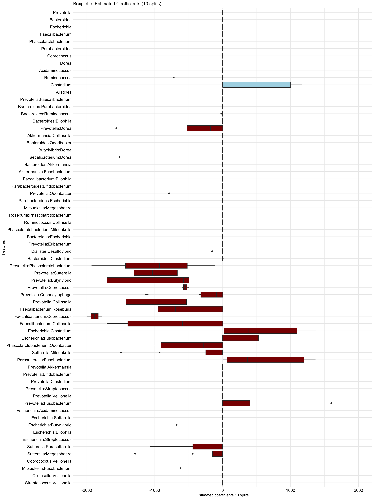

04b-ARGs-interactions-binary
================
Compiled at 2025-02-17 08:14:57 UTC

Here we only use the binarized presence-absence information of the
mOTUs.

``` r
library("conflicted")
library(dplyr)
library(tidyr)
library(textshape)
library(ggplot2)
library(hierNet)
library(gridExtra)
library(glmnet)
library(RColorBrewer)
```

### Read data

``` r
path_data <- "data/"
mOTU_all <- readRDS(paste0(path_data, "mOTU_all.rds"))
meta_all <- readRDS(paste0(path_data, "Metadata_all.rds"))
```

``` r
## extract genus level and adjust names
mOTU_genus <- mOTU_all$Genus
rownames(mOTU_genus) <- substr(rownames(mOTU_genus), 4, nchar(rownames(mOTU_genus)))

mOTU_genus[1:5, 1:5]
```

    ##            _Bacteroides_ _Cellvibrio_ _Clostridium_ _Eubacterium_
    ## x10MCx1134             0            0       3687231             0
    ## x10MCx1135             0            0       5313951             0
    ## x10MCx1138             0            0             0             0
    ## x10MCx1140             0            0      21581161             0
    ## x10MCx1143             0            0             0             0
    ##            _Ruminococcus_
    ## x10MCx1134     3158547431
    ## x10MCx1135      336839421
    ## x10MCx1138      208437127
    ## x10MCx1140      682029749
    ## x10MCx1143      413187394

Remove samples with missing data in the metadata

``` r
dim(meta_all)
```

    ## [1] 2173  243

Read ARG data and add it to meta data

``` r
arg_df <- read.table(paste0(path_data, "hub.microbiome.summary.down.10000000.r"), sep='\t')
arg_df <- arg_df %>% 
  pivot_wider(id_cols = "SampleID", names_from="Feature", values_from = "FeatureValue") %>% 
  select(SampleID, CARD10M) # For now only interested in ARGs

head(arg_df)
```

    ## # A tibble: 6 × 2
    ##   SampleID   CARD10M
    ##   <chr>        <dbl>
    ## 1 x20MCx2508  118088
    ## 2 x10MCx3076  106544
    ## 3 x30MCx2303  118960
    ## 4 x30MCx2933  133495
    ## 5 x20MCx2635  115226
    ## 6 x30MCx3237  125620

``` r
meta_arg <- meta_all %>% 
  tibble::rownames_to_column("SampleID") %>% 
  left_join(arg_df, by="SampleID") %>% 
  column_to_rownames("SampleID")
meta_all <- meta_arg
```

``` r
meta_all.f = meta_all[complete.cases(meta_all),]
dim(meta_all.f)
```

    ## [1] 702 244

``` r
ind_genus = intersect(rownames(meta_all.f), rownames(mOTU_genus))
length(ind_genus)
```

    ## [1] 690

``` r
dim(mOTU_genus)
```

    ## [1] 1818  710

``` r
## only merged / intersection
meta_all.f.m <- meta_all.f[ind_genus, ]
mOTU_genus.m <- mOTU_genus[ind_genus, ]

dim(meta_all.f.m)
```

    ## [1] 690 244

``` r
dim(mOTU_genus.m)
```

    ## [1] 690 710

Remove covariates with only zeros (this step is not really necessary if
we only look into ARGs)

``` r
sum(colSums(meta_all.f.m!= 0) == 0)
```

    ## [1] 42

``` r
meta_all.f.m = meta_all.f.m[, colSums(meta_all.f.m!= 0) > 0]
```

Let’s take into account the 30 most abundant genera, remove
“unclassified”:

``` r
order_abund <- order(colSums(mOTU_genus.m), decreasing = T)
X <- mOTU_genus.m[, order_abund[2:33]]
## remove duplicates
X <- X[, !(colnames(X) %in% c("_Ruminococcus_", "_Bacteroides_"))]
```

binarize X

``` r
X[X < 5] <- 0
# X[X < 1] <- 0 # doesn't make a difference on results
X[X > 0] <- 1
table(X)
```

    ## X
    ##     0     1 
    ##  6869 13831

As outcome y we choose the number of ARGs

``` r
y <- meta_all.f.m$CARD10M
names(y) <- rownames(meta_all.f.m)
all(names(y) == rownames(X))
```

    ## [1] TRUE

## All pairs-lasso

``` r
nsplit <- 10
rsq <- function (x, y) cor(x, y) ^ 2

fit.glmnet <- list()
cvfit.glmnet<- list()
yhat_tr.glmnet <- list()
yhat_te.glmnet <- list()
Xall <- cbind(X, hierNet::compute.interactions.c(X, diagonal = F)) 

tr <- list()
ntot <- length(y)
p <- ncol(X)
n <- round(2/3 * ntot)
set.seed(123)
Xm <- X + 0.00001 * matrix(rnorm(length(X)), nrow = nrow(X), ncol = ncol(X))
for(r in seq(nsplit)){
  set.seed(r)
  tr[[r]] <- sample(ntot, n)
  
  fit.glmnet[[r]] <- glmnet(Xall[tr[[r]], ], y[tr[[r]]])
  # set.seed(r)
  cvfit.glmnet[[r]] <- cv.glmnet(Xall[tr[[r]], ], y[tr[[r]]], nfolds = 5)
  yhat_tr.glmnet[[r]] <- predict(cvfit.glmnet[[r]], newx = Xall[tr[[r]], ], s = "lambda.min")
  yhat_te.glmnet[[r]] <- predict(cvfit.glmnet[[r]], newx = Xall[-tr[[r]], ], s = "lambda.min")
}
```

boxplot of coefficients over 10 train-test splits

``` r
p = ncol(X)
coef_mat_allsplits.glmnet <- matrix(nrow = p * (p - 1) /2 + p, ncol = nsplit)
for(r in seq(nsplit)){
  coef_mat_allsplits.glmnet[, r] <- coef(cvfit.glmnet[[r]], s = "lambda.min")[-1]

}

rownames(coef_mat_allsplits.glmnet) <- colnames(Xall)
coef_mat_allsplits.glmnet <- t(coef_mat_allsplits.glmnet)
# saveRDS(coef_mat_allsplits.glmnet, "coef_APL_binary_ARGs.rds")
```

<!-- -->

``` r
list_plt_glmnet <- list()
for (r in seq(nsplit)) {
  data <- data.frame(Observed = y[-tr[[r]]], Predicted = as.vector(yhat_te.glmnet[[r]]))
  
  list_plt_glmnet[[r]] <- ggplot(data, aes(y = Observed, x = Predicted)) +
    geom_point(alpha = 0.7, size = 2) +  # Set alpha for transparency
    geom_abline(intercept = 0, slope = 1, color = "grey", linetype = "dashed") +
    labs(title = paste0("Quadratic Lasso (APL): train-test split ", r),
         x = "Predicted number of ARGs (test set)", y = "Observed number of ARGs (test set)") +
    theme_minimal() + xlim(range(c(data$Observed, data$Predicted)))+ 
    theme(axis.text = element_text(color = "black", size = 12), 
          axis.title.y = element_text(color = "black", size = 12),                                            
          axis.title.x = element_text(color = "black", size = 12)
          )
}

# Arrange the ggplots in a single row
# grid.arrange(grobs = list_plt_glmnet[1:2], ncol = 2)
```

``` r
Rsq <- c()
for(r in seq(nsplit)){
  Rsq[r] <- rsq(y[-tr[[r]]], as.vector(yhat_te.glmnet[[r]]))
}
mean(Rsq)
```

    ## [1] 0.2764797

``` r
list_plt_glmnet <- list()
for (r in seq(nsplit)) {
  data <- data.frame(Observed = y[-tr[[r]]], Predicted = as.vector(yhat_te.glmnet[[r]]))
  
  list_plt_glmnet[[r]] <- ggplot(data, aes(x = Observed, y = Predicted)) +
    geom_point(alpha = 0.5) +  # Set alpha for transparency
    geom_abline(intercept = 0, slope = 1, color = "grey", linetype = "dashed") +
    labs(title = paste0("Quadratic Lasso (APL), presence-absence: train-test split ", r),
         y = "Predicted (test set)", x = "Observed (test set)") +
    theme_minimal() + ylim(range(data$Observed))
}


# Arrange the ggplots in a single row
# grid.arrange(grobs = list_plt_glmnet[1:2], ncol = 2)
```

## Files written

These files have been written to the target directory,
`data/04b-ARGs-interactions-binary`:

``` r
projthis::proj_dir_info(path_target())
```

    ## # A tibble: 0 × 4
    ## # ℹ 4 variables: path <fs::path>, type <fct>, size <fs::bytes>,
    ## #   modification_time <dttm>
