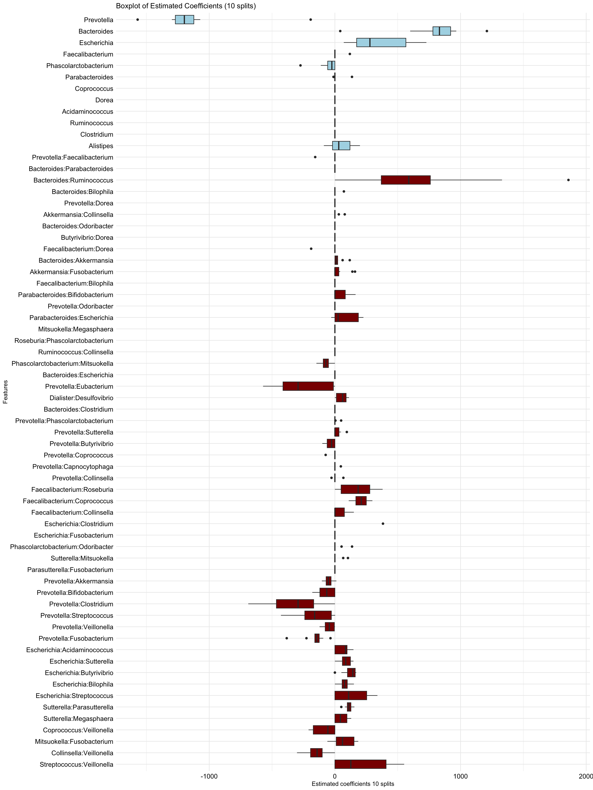

04c-ARGs-interactions-relative
================
Compiled at 2024-04-27 14:10:41 UTC

Here we treat the counts as relative abundances.

``` r
library("conflicted")
library(dplyr)
library(tidyr)
library(textshape)
library(ggplot2)
#devtools::install_github("viettr/trac", dependencies = TRUE, ref = "prediction_during_cv")
library(trac)
library(gridExtra)
```

### Read data

``` r
path_data <- "data/"
mOTU_all <- readRDS(paste0(path_data, "mOTU_all.rds"))
meta_all <- readRDS(paste0(path_data, "Metadata_all.rds"))
```

``` r
## extract genus level and adjust names
mOTU_genus <- mOTU_all$Genus
rownames(mOTU_genus) <- substr(rownames(mOTU_genus), 4, nchar(rownames(mOTU_genus)))

mOTU_genus[1:5, 1:5]
```

    ##            _Bacteroides_ _Cellvibrio_ _Clostridium_ _Eubacterium_
    ## x10MCx1134             0            0       3687231             0
    ## x10MCx1135             0            0       5313951             0
    ## x10MCx1138             0            0             0             0
    ## x10MCx1140             0            0      21581161             0
    ## x10MCx1143             0            0             0             0
    ##            _Ruminococcus_
    ## x10MCx1134     3158547431
    ## x10MCx1135      336839421
    ## x10MCx1138      208437127
    ## x10MCx1140      682029749
    ## x10MCx1143      413187394

1.  Remove samples with missing data in the metadata

``` r
dim(meta_all)
```

    ## [1] 2173  243

Read ARG data and add it to meta data

``` r
arg_df <- read.table(paste0(path_data, "hub.microbiome.summary.down.10000000.r"), sep='\t')
arg_df <- arg_df %>% 
  pivot_wider(id_cols = "SampleID", names_from="Feature", values_from = "FeatureValue") %>% 
  select(SampleID, CARD10M) # For now only interested in ARGs

head(arg_df)
```

    ## # A tibble: 6 × 2
    ##   SampleID   CARD10M
    ##   <chr>        <dbl>
    ## 1 x20MCx2508  118088
    ## 2 x10MCx3076  106544
    ## 3 x30MCx2303  118960
    ## 4 x30MCx2933  133495
    ## 5 x20MCx2635  115226
    ## 6 x30MCx3237  125620

``` r
meta_arg <- meta_all %>% 
  tibble::rownames_to_column("SampleID") %>% 
  left_join(arg_df, by="SampleID") %>% 
  tibble::column_to_rownames("SampleID")
meta_all <- meta_arg
```

``` r
meta_all.f = meta_all[complete.cases(meta_all),]
dim(meta_all.f)
```

    ## [1] 702 244

``` r
ind_genus = intersect(rownames(meta_all.f), rownames(mOTU_genus))
length(ind_genus)
```

    ## [1] 690

``` r
dim(mOTU_genus)
```

    ## [1] 1818  710

``` r
## only merged / intersection
meta_all.f.m <- meta_all.f[ind_genus, ]
mOTU_genus.m <- mOTU_genus[ind_genus, ]

dim(meta_all.f.m)
```

    ## [1] 690 244

``` r
dim(mOTU_genus.m)
```

    ## [1] 690 710

2.  Remove covariates with only zeros

``` r
sum(colSums(meta_all.f.m!= 0) == 0)
```

    ## [1] 42

``` r
meta_all.f.m = meta_all.f.m[, colSums(meta_all.f.m!= 0) > 0]
```

Let’s take into account the 30 most abundant genera, remove
“unclassified”:

``` r
order_abund <- order(colSums(mOTU_genus.m), decreasing = T)
X <- mOTU_genus.m[, order_abund[2:33]]
## remove duplicates
X <- X[, !(colnames(X) %in% c("_Ruminococcus_", "_Bacteroides_"))]
```

As y we choose the number of ARGs

``` r
y <- meta_all.f.m$CARD10M
names(y) <- rownames(meta_all.f.m)
all(names(y) == rownames(X))
```

    ## [1] TRUE

Make sure there are no special characters in the names

``` r
colnames(X) <- gsub("_", "", colnames(X))
```

``` r
pseudo_count <- 1

Xm <- as.matrix(X + 0.00001 * matrix(rnorm(length(X)), nrow = nrow(X), ncol = ncol(X)))
if(sum(Xm == 0) > 0){X_psd <- as.matrix(Xm + pseudo_count)}
X_psd <- as.matrix(Xm + pseudo_count)
#X_rel <- Xm/rowSums(Xm)
X_rel <- X_psd/rowSums(X_psd)
```

### Fit SLC and SLC + int model

``` r
source("R/sparse_log_contrast.R")
source("R/slc_int.R")
source("R/slc_int_plots.R")
source("R/log-ratio-lasso_interactions.R")
source("R/utils.R")
```

``` r
library(trac)
```

``` r
slc_slc_int_ARGs <- slc_slc_int_all_splits(X = as.matrix(X_rel),
                                             y = y,
                                             method = "regr", output = "raw", ii = "ibest")
```

### OOS MS

``` r
nsplit = 10 
rsq <- function (x, y) cor(x, y) ^ 2

list_plt_slcint <- list()
tr <- list()
yhat_te <- list()

for (r in seq(nsplit)) {
  yhat_te[[r]] <- slc_slc_int_ARGs$yhat_te_int[[r]][, slc_slc_int_ARGs$cvfit[[r]]$cv$ibest]
  tr[[r]] <- slc_slc_int_ARGs$tr[[r]]
  data <- data.frame(Observed = y[-tr[[r]]], Predicted = as.vector(yhat_te[[r]]))
  
  list_plt_slcint[[r]] <- ggplot(data, aes(x = Observed, y = Predicted)) +
    geom_point(alpha = 0.5) +  # Set alpha for transparency
    geom_abline(intercept = 0, slope = 1, color = "red") +
    labs(title = paste0("slcInt: Train-test split ", r), y = "Predicted (test)", x = "Observed (test)") +
    annotate("text", x = max(data$Observed), y = min(data$Predicted),
             label = paste0("R-squared: ", round(rsq(data$Observed, data$Predicted), 2)),
             vjust = 1, hjust = 1) +
    theme_minimal()
}


# Arrange the ggplots in a single row
grid.arrange(grobs = list_plt_slcint[1:3], ncol = 3)
```

<!-- -->

<!-- -->

## Files written

These files have been written to the target directory,
`data/04c-ARGs-interactions-relative`:

``` r
projthis::proj_dir_info(path_target())
```

    ## # A tibble: 0 × 4
    ## # ℹ 4 variables: path <fs::path>, type <fct>, size <fs::bytes>,
    ## #   modification_time <dttm>
