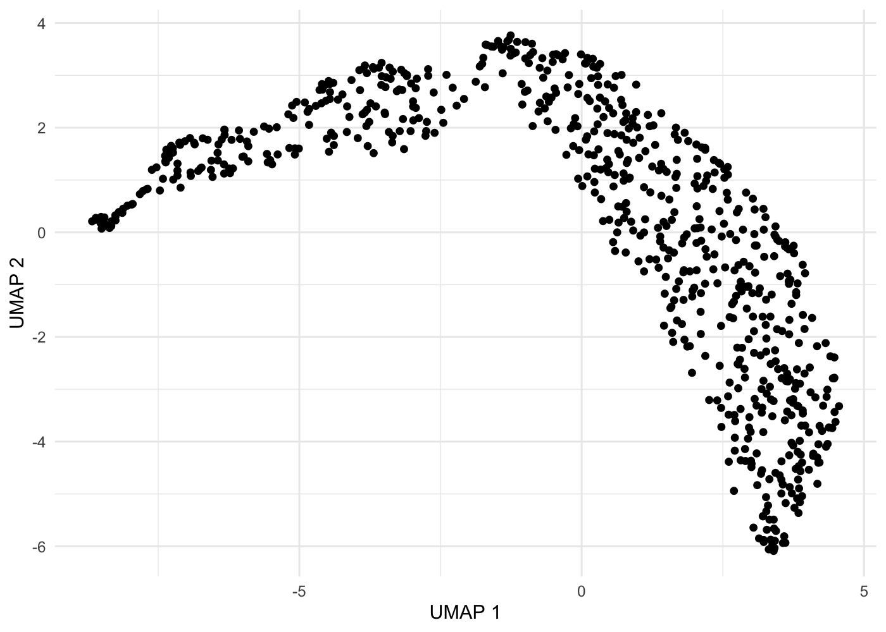
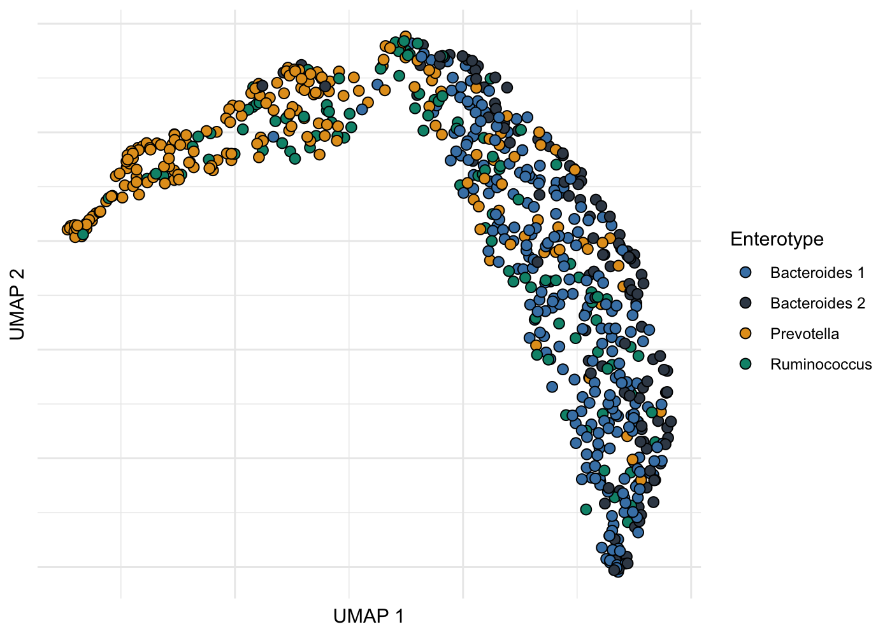
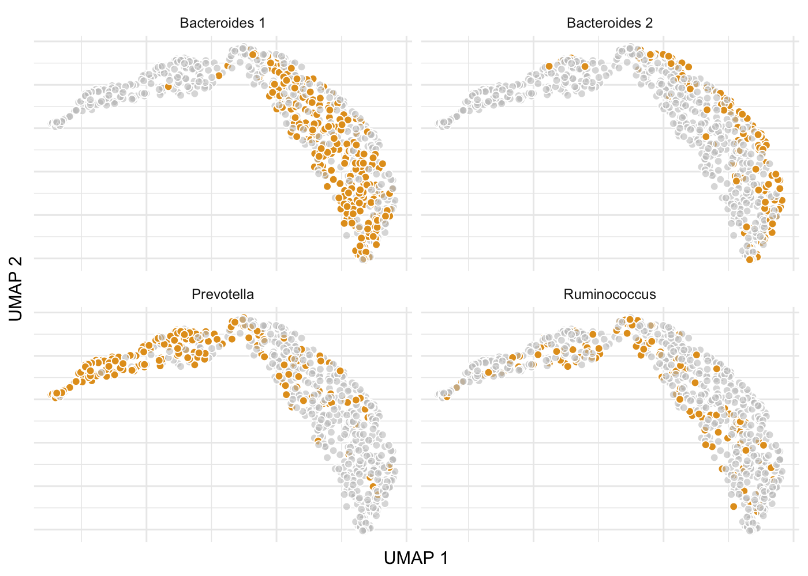
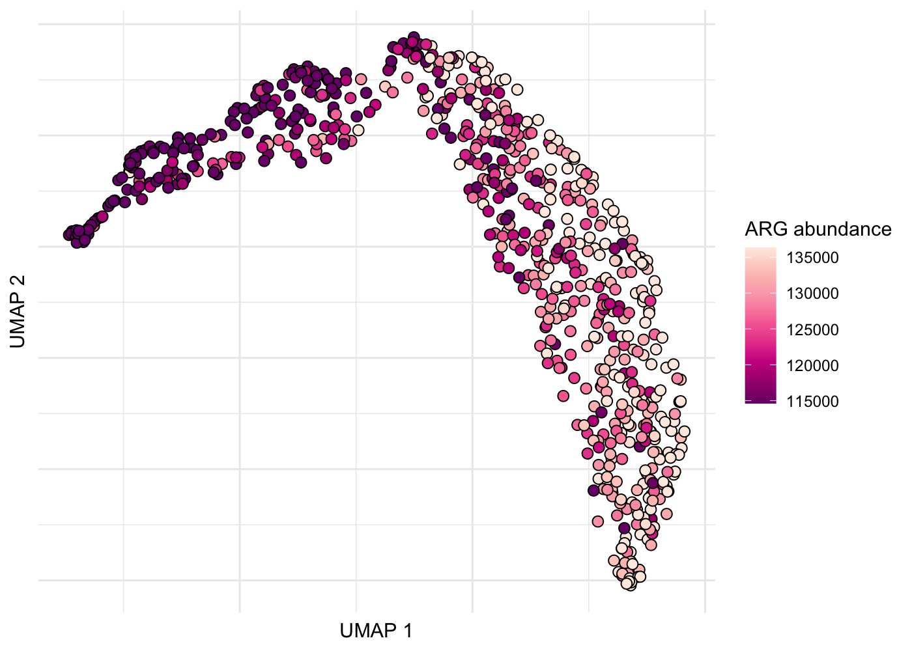
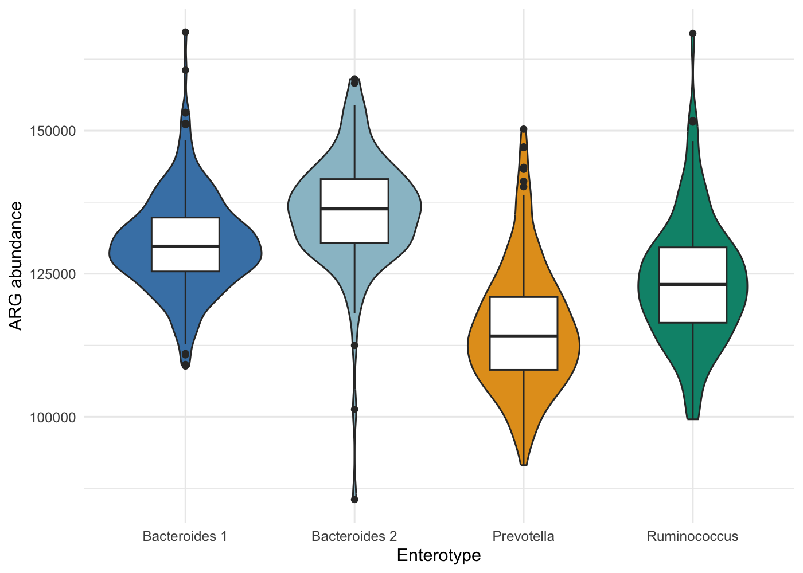
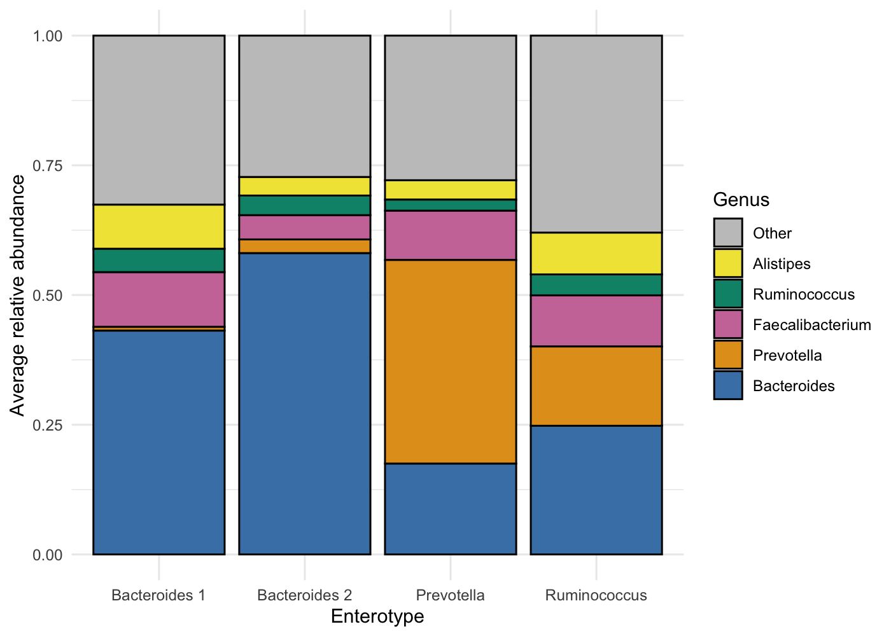

04d-ARGs-interactions-enterotypes
================
Compiled at 2024-11-29 09:11:51 UTC

``` r
here::i_am(paste0(params$name, ".Rmd"), uuid = "5518e134-1742-47fe-95a8-a0762c1536b6")
knitr::opts_chunk$set(dpi = 200, echo = T, warning = F, message = F)
```

The purpose of this document is …

``` r
library(dplyr)
library(tidyr)
library(textshape)
library(ggplot2)
library(gridExtra)

library(uwot)
```

``` r
# create or *empty* the target directory, used to write this file's data: 
projthis::proj_create_dir_target(params$name, clean = TRUE)

# function to get path to target directory: path_target("sample.csv")
path_target <- projthis::proj_path_target(params$name)

# function to get path to previous data: path_source("00-import", "sample.csv")
path_source <- projthis::proj_path_source(params$name)
```

### Read data.

Metadata and mOTU abundance

``` r
path_data <- "data/"
mOTU_all <- readRDS(paste0(path_data, "mOTU_all.rds"))
meta_all <- readRDS(paste0(path_data, "Metadata_all.rds"))
```

``` r
## extract genus level and adjust names
mOTU_genus <- mOTU_all$Genus
rownames(mOTU_genus) <- substr(rownames(mOTU_genus), 4, nchar(rownames(mOTU_genus)))
```

Read ARG data

``` r
arg_df <- read.table(paste0(path_data, "hub.microbiome.summary.down.10000000.r"), sep='\t')
arg_df <- arg_df %>% 
  pivot_wider(id_cols = "SampleID", names_from="Feature", values_from = "FeatureValue") %>% 
  select(SampleID, CARD10M) # For now only interested in ARGs

head(arg_df)
```

    ## # A tibble: 6 × 2
    ##   SampleID   CARD10M
    ##   <chr>        <dbl>
    ## 1 x20MCx2508  118088
    ## 2 x10MCx3076  106544
    ## 3 x30MCx2303  118960
    ## 4 x30MCx2933  133495
    ## 5 x20MCx2635  115226
    ## 6 x30MCx3237  125620

Read enterotype data

``` r
enterotype_df <- read.table(paste0(path_data, "hub.enterotype.v1.data.frame.r"), sep='\t', header = TRUE)

enterotype_df <- enterotype_df %>% 
  filter(FeatureValue == 1) %>% 
  select(SampleID, FeatureDisplayName) %>% 
  
  rename("Enterotype" = "FeatureDisplayName") # Rename for simplicity


enterotype_df %>% head()
```

    ##     SampleID    Enterotype
    ## 1 x10MCx2042 Bacteroides 2
    ## 2 x20MCx1912    Prevotella
    ## 3 x30MCx1266  Ruminococcus
    ## 4 x10MCx1960    Prevotella
    ## 5 x13MCx3413 Bacteroides 2
    ## 6 x12MCx3046 Bacteroides 1

Add ARG and enterotypes to metadata.

``` r
meta_arg <- meta_all %>% 
  tibble::rownames_to_column("SampleID") %>% 
  left_join(arg_df, by="SampleID") %>% 
  left_join(enterotype_df, by="SampleID") %>% 
  column_to_rownames("SampleID")
meta_all <- meta_arg
```

Remove samples with missing metadata

``` r
meta_all.f = meta_all[complete.cases(meta_all),]
dim(meta_all.f)
```

    ## [1] 702 245

Only consider samples that are present in abundance and metadata

``` r
ind_genus = intersect(rownames(meta_all.f), rownames(mOTU_genus))
length(ind_genus)
```

    ## [1] 690

``` r
dim(mOTU_genus)
```

    ## [1] 1818  710

``` r
## only merged / intersection
meta_all.f.m <- meta_all.f[ind_genus, ]
mOTU_genus.m <- mOTU_genus[ind_genus, ]

dim(meta_all.f.m)
```

    ## [1] 690 245

``` r
dim(mOTU_genus.m)
```

    ## [1] 690 710

2.  Remove covariates with only zeros

``` r
sum(colSums(meta_all.f.m!= 0) == 0)
```

    ## [1] 42

``` r
meta_all.f.m = meta_all.f.m[, colSums(meta_all.f.m!= 0) > 0]

meta_all.f.m <- meta_all.f.m %>% 
  tibble::rownames_to_column("SampleID")
```

Let’s take into account the 30 most abundant genera, remove
“unclassified”:

``` r
order_abund <- order(colSums(mOTU_genus.m), decreasing = T)
X <- mOTU_genus.m[, order_abund[2:33]]
## remove duplicates
X <- X[, !grepl("^_", colnames(X))]
```

### UMAP embedding.

Compute sample UMAP embeddings using `UWOT`.

``` r
set.seed(42)
sample.umap <- umap(X=X,
                 n_neighbors = 50,
                 n_components = 2,
                 min_dist = 0.2, 
                 n_threads = 4,
                 metric="euclidean")


sample.umap <- as.data.frame(sample.umap) %>% 
  tibble::rownames_to_column("SampleID")
```

``` r
sample.umap %>% 
  ggplot(aes(x=V1, y=V2)) +
  geom_point() +
  theme_minimal() +
  labs(x="UMAP 1",
       y="UMAP 2")
```

<!-- -->

Color UMAP based on enterotype.

``` r
sample.umap <- sample.umap %>% 
  left_join(meta_all.f.m %>% select(SampleID, Enterotype, CARD10M), by="SampleID")
```

``` r
entero.umap <- ggplot(sample.umap, aes(x=V1, y=V2, fill=Enterotype)) +
  geom_point(shape=21, color="black", size=2.5) +
  
  scale_fill_manual(values = c("#4682b4", "#3b4856", "#e39e21", "#009179")) +
  
  
  theme_minimal() +
  
  labs(x="UMAP 1",
       y="UMAP 2") +
  
  theme(
    axis.ticks.x = element_blank(),
        axis.text.x = element_blank(),
        axis.ticks.y = element_blank(),
        axis.text.y = element_blank())

entero.umap
```

<!-- -->

Enterotype assignment as a grid.

``` r
bact1.df <- sample.umap %>% 
  mutate(entero.grid  = "Bacteroides 1",
         entero.sample = if_else(Enterotype == "Bacteroides 1", TRUE, FALSE))

bact2.df <- sample.umap %>% 
  mutate(entero.grid  = "Bacteroides 2",
         entero.sample = if_else(Enterotype == "Bacteroides 2", TRUE, FALSE))

prev.df <- sample.umap %>% 
  mutate(entero.grid  = "Prevotella",
         entero.sample = if_else(Enterotype == "Prevotella", TRUE, FALSE))


rum.df <- sample.umap %>% 
  mutate(entero.grid  = "Ruminococcus",
         entero.sample = if_else(Enterotype == "Ruminococcus", TRUE, FALSE))

grid.umap.df <- bind_rows(bact1.df, bact2.df, prev.df, rum.df) %>% 
  mutate(entero.sample = factor(entero.sample, levels=c(TRUE, FALSE)))


enterotype.grid.p <- ggplot(grid.umap.df, aes(x=V1, y=V2, fill=entero.sample)) +
  geom_point(shape=21, color="white", size=2) +
  scale_fill_manual(values = c("#e39e21", alpha("#C5C5C5", 0.6))) +
  
  facet_wrap(~entero.grid, ncol=2) +
  
  theme_minimal() +
  
  labs(x="UMAP 1",
       y="UMAP 2",
       fill="Sample is Enterotype") +
  
  theme(legend.position = "none",
    axis.ticks.x = element_blank(),
        axis.text.x = element_blank(),
        axis.ticks.y = element_blank(),
        axis.text.y = element_blank())

enterotype.grid.p
```

<!-- -->

Now color ARG abundance.

``` r
# Robust range for easier viz
sample.umap <- sample.umap %>% 
  mutate(CARD10M_robust = case_when(CARD10M > quantile(CARD10M, 0.80) ~ quantile(CARD10M, 0.80),
                                    CARD10M < quantile(CARD10M, 0.20) ~ quantile(CARD10M, 0.20),
                                    TRUE ~ CARD10M))
```

``` r
arg.umap <- ggplot(sample.umap, aes(x=V1, y=V2, fill=CARD10M_robust)) +
  geom_point(shape=21, color="black", size=2.5) +
  
  
  scale_fill_distiller(palette = "RdPu") +
  
  theme_minimal() +
  
  labs(x="UMAP 1",
       y="UMAP 2",
       fill = "ARG abundance") +
  
  theme(
    axis.ticks.x = element_blank(),
        axis.text.x = element_blank(),
        axis.ticks.y = element_blank(),
        axis.text.y = element_blank())

arg.umap
```

<!-- -->

Boxplot of arg abundance vs enterotype

``` r
arg.enterotype.bp <- ggplot(sample.umap, aes(x=Enterotype, y=CARD10M)) +
  geom_violin(aes(fill=Enterotype)) +
  
  geom_boxplot(width=0.4) +
  
  scale_fill_manual(values = c("#4682b4", "lightblue3", "#e39e21", "#009179")) +
  
  theme_minimal() +
  theme(legend.position = "none") +
  labs(y="ARG abundance")

arg.enterotype.bp
```

<!-- -->

Average relative abunance of different taxa by enterotype.

``` r
# A list of the genus we are interested in
genus.interest <- c("Bacteroides", "Prevotella", "Faecalibacterium", "Ruminococcus", "Alistipes")


# Transform X from absolute counts into relative abundance
Xrel <- X / rowSums(X)


# Prepare relative abundance data
relative.by.enterotype.df <- as.data.frame(Xrel) %>% 
  
  # Pivot longer
  tibble::rownames_to_column("SampleID") %>% 
  pivot_longer(cols=-SampleID, names_to = "Genus", values_to = "rel.abundance") %>% 
  
  # Add enterotype information
  left_join(sample.umap %>% select(SampleID, Enterotype), by="SampleID") %>% 
  
  # Get the average relative abundance of each genus per enterotype
  group_by(Enterotype, Genus) %>% 
  summarise(avg.rel.abundance = mean(rel.abundance)) %>% 
  ungroup()
  

# Now we need to aggregate the "Other" genus
relative.by.enterotype.agg.df <- relative.by.enterotype.df %>% 
  
  # Change the Genus to relfect the categories we are interested in
  mutate(Genus_viz = if_else(Genus %in% genus.interest, Genus, "Other")) %>% 
  group_by(Enterotype, Genus_viz) %>% 
  
  # Aggregate counts by class of interest
  summarise(agg.avg.rel.abundance = sum(avg.rel.abundance)) %>% 
  ungroup()


relative.by.enterotype.agg.df %>% head()
```

    ## # A tibble: 6 × 3
    ##   Enterotype    Genus_viz        agg.avg.rel.abundance
    ##   <chr>         <chr>                            <dbl>
    ## 1 Bacteroides 1 Alistipes                      0.0853 
    ## 2 Bacteroides 1 Bacteroides                    0.431  
    ## 3 Bacteroides 1 Faecalibacterium               0.106  
    ## 4 Bacteroides 1 Other                          0.326  
    ## 5 Bacteroides 1 Prevotella                     0.00699
    ## 6 Bacteroides 1 Ruminococcus                   0.0449

``` r
rel.abundance.barplot <- relative.by.enterotype.agg.df %>% 
  mutate(Genus_viz = factor(Genus_viz, levels=c("Other", "Alistipes", "Ruminococcus", "Faecalibacterium", "Prevotella", "Bacteroides"))) %>% 
  
  
  ggplot(aes(x=Enterotype, y=agg.avg.rel.abundance, fill=Genus_viz)) +
  geom_bar(position="stack", stat="identity", color="black")  +
  
  
  scale_fill_manual(values=rev(c("#4682b4", "#e39e21","#CC79A7","#009179", "#F0E442", "#C5C5C5"))) +
  
  theme_minimal() +
  
  labs(y="Average relative abundance",
       fill="Genus")

rel.abundance.barplot
```

<!-- -->

## Files written

These files have been written to the target directory,
`data/04d-ARGs-interactions-enterotypes`:

``` r
projthis::proj_dir_info(path_target())
```

    ## # A tibble: 0 × 4
    ## # ℹ 4 variables: path <fs::path>, type <fct>, size <fs::bytes>,
    ## #   modification_time <dttm>
